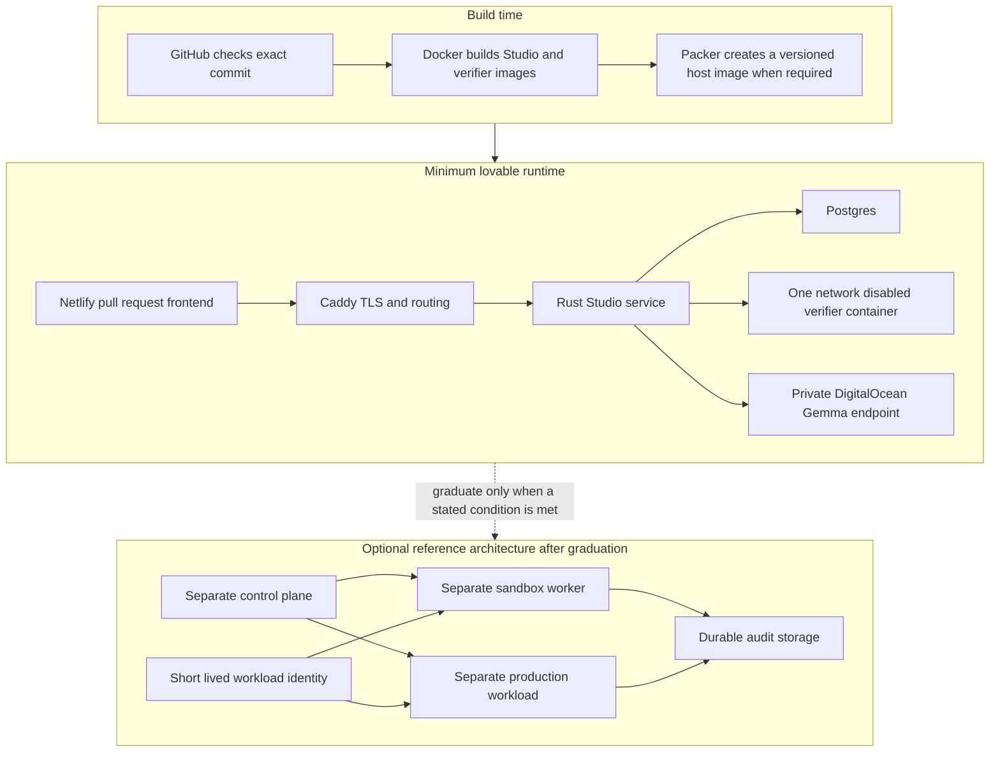

# Decision 0010: Minimum lovable runtime

Status: accepted

Issue: [#68](https://github.com/ChaiWithJai/hashistack-healthcare/issues/68)

## Decision

Practice Studio has one supported runtime for the minimum lovable version.
Docker Compose runs the application on a laptop and on one DigitalOcean
Droplet. Packer will create a versioned host image when host replacement time
becomes part of the release gate. Terraform may create the host, firewall, and
DNS. Terraform and Packer do not run application requests.

The minimum lovable version does not run Nomad, Vault, or Kubernetes. The old
Nomad and Vault files remain as research and as input to a later reference
architecture. They are not setup instructions for the current product.

Gemma is the only application model. Gemma receives a bounded request and
chooses from signed treatments. Gemma has no tools, file access, secrets,
deployment rights, or patient data. Rust checks the response and owns source
creation, verification, checkpoints, acceptance, export, and deployment
decisions.

The hosted request has a 20 second budget because the pull request frontend
uses a Netlify proxy. If Gemma is slower, Rust returns the same signed treatment
set and labels the fallback in the workspace evidence. The doctor can continue
instead of receiving a proxy timeout. The provider profile separately proves
that Gemma can return a valid treatment with no fallback.

## User outcome

A doctor can build a small practice tool with synthetic data. The core flow
works without login. Clerk asks for identity only when the doctor claims or
exports a workspace.

The doctor can:

1. Choose a signed clinical starter.
2. Describe the job the tool should help with.
3. Compare bounded treatments proposed by Gemma.
4. Select a treatment and inspect the source change.
5. Run fixed checks against the generated source.
6. Publish a synthetic preview.
7. Repair a failed release check.
8. Export the exact reviewed source and its evidence.

The export is the handoff to a developer. It contains the reviewed Svelte
client, Rust server, tests, synthetic fixtures, three editable diagrams, and
one README. The README explains how to build, change, and run the application.
It also lists the controls that the prototype does not provide.

## Architecture



The DigitalOcean host has 4 GB of memory and admits one verifier container at
a time. The verifier image must be executable and pinned by SHA 256 digest.
The verifier runs fixed checks with networking disabled. It does not run model
code.

Netlify serves the exact pull request frontend. That frontend calls the
DigitalOcean staging API. A reviewer can therefore test the user experience
before the pull request merges.

## Proof required for the minimum lovable version

The following results must be observed. A plan or configuration file is not
proof that a result occurred.

- The browser completes the full doctor workflow without login until claim or
  export.
- The pull request has a shareable Netlify preview for its exact frontend.
- DigitalOcean staging runs the exact reviewed Rust commit.
- Gemma returns a valid signed treatment and Rust rejects invalid output.
- The hosted verifier compiles and tests source without network access.
- A second verifier request is rejected while the first request runs.
- The doctor sees each check and the reason for a failure.
- A stranger can use only the exported README to build, change, and run the
  application.
- At least 10 exports are measured for build time, bundle size, startup time,
  memory use, task completion, customization, and export success.

## Known limits

The current product is a synthetic learning environment. It is not approved
for patient data or clinical care. One host is one failure domain. The current
repository does not prove tenant isolation, patient data controls, short lived
workload credentials, durable off host audit retention, or a production
restore process.

These limits must appear in the product and in every export.

## Graduation conditions

We add a separate sandbox worker when generated code must run outside the
control plane or when the 4 GB host cannot safely handle verification work. We
add a separate production workload boundary before any workload can receive
patient data. We add tenant data boundaries, workload identity, owned keys,
durable audit storage, restore tests, monitoring, and an incident process
before making a production health care claim.

Nomad and Vault are possible choices for that reference architecture. They are
not required by the exported application or by its evidence format. Kubernetes
is not a supported path because this project will not maintain two schedulers.

## Cost and teardown

The measured DigitalOcean baseline is one `s-2vcpu-4gb` Droplet at $24 per
month before backups. The private Gemma endpoint and Netlify usage have their
own charges. Record current provider prices at each proof because prices can
change.

Destroy a disposable DigitalOcean host with:

```sh
terraform -chdir=terraform/single-host/digitalocean destroy
```

Export owned applications, the audit stream, and a database backup before
destroying any environment that people still use.
