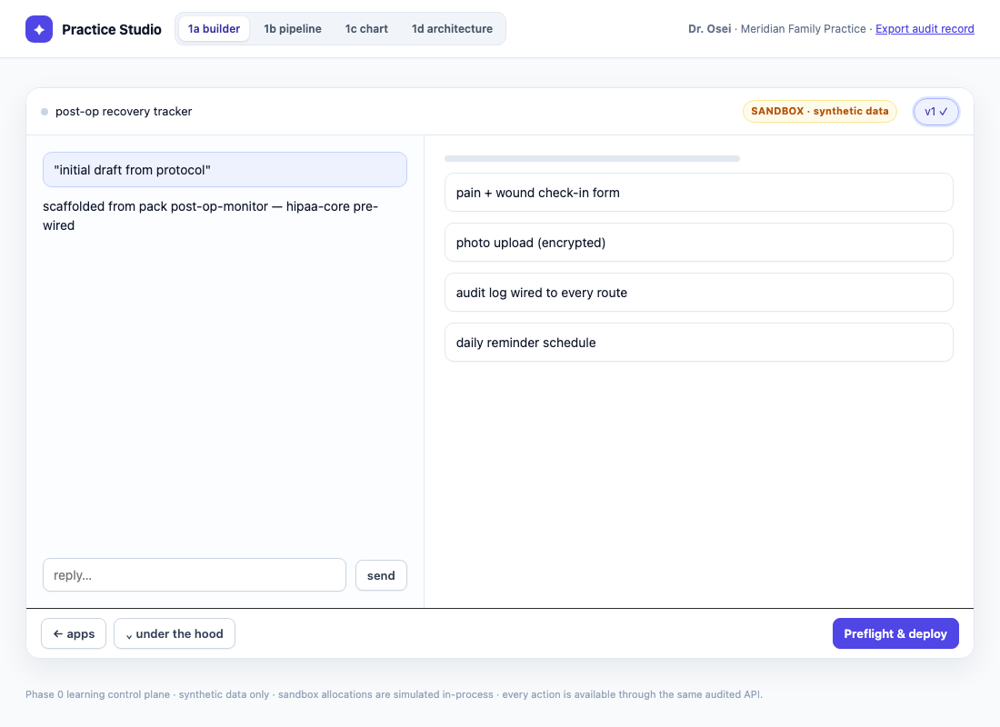
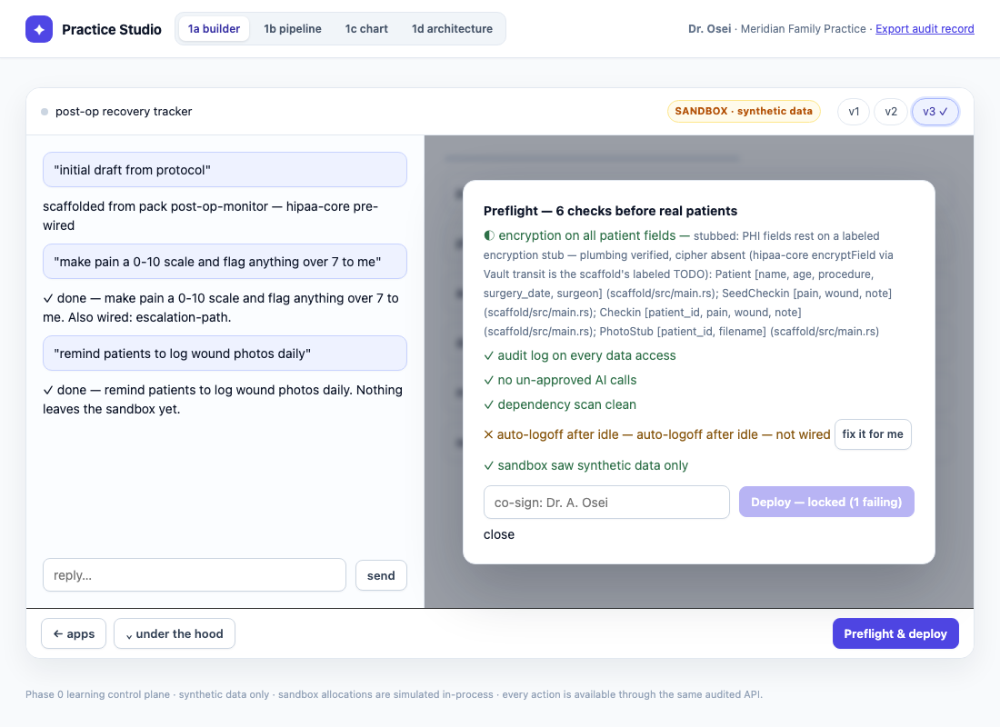
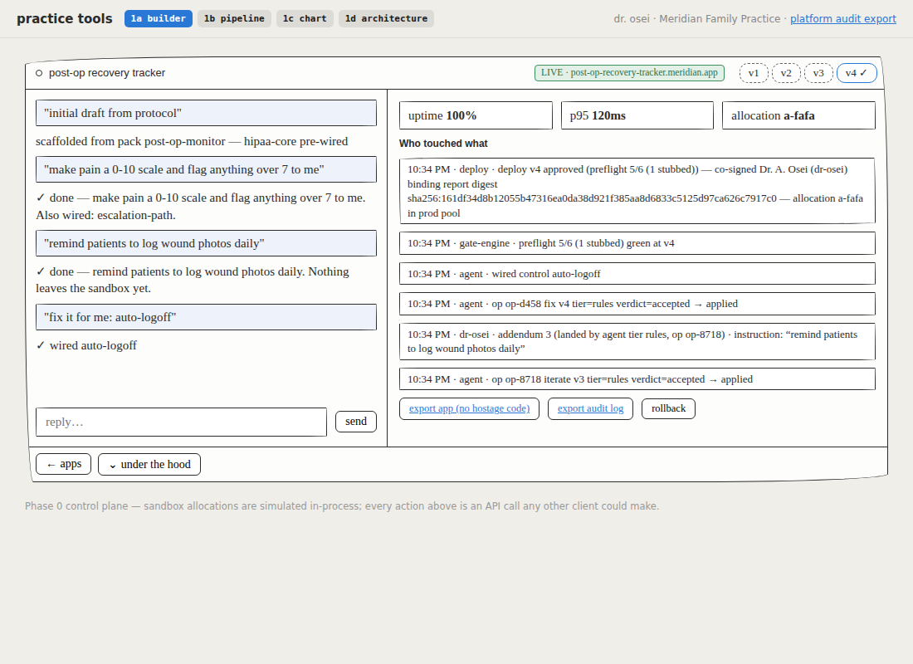
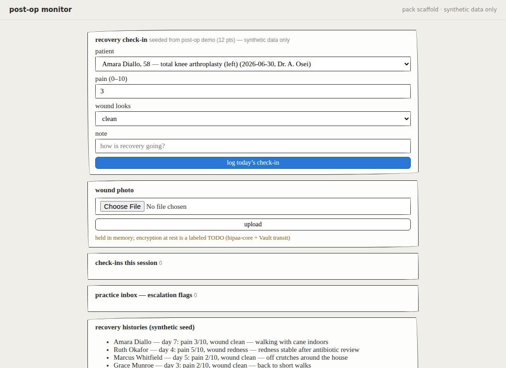
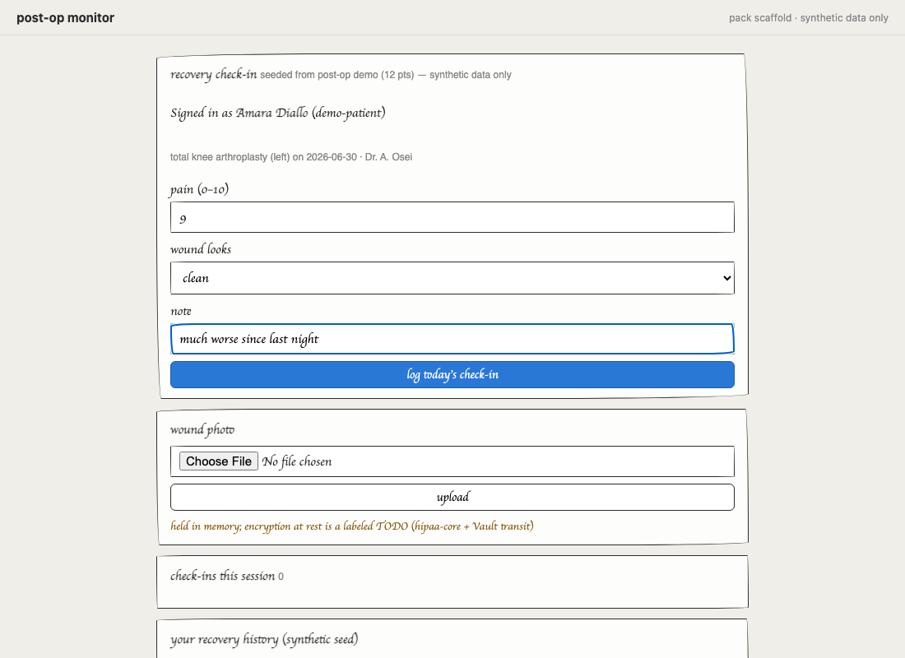
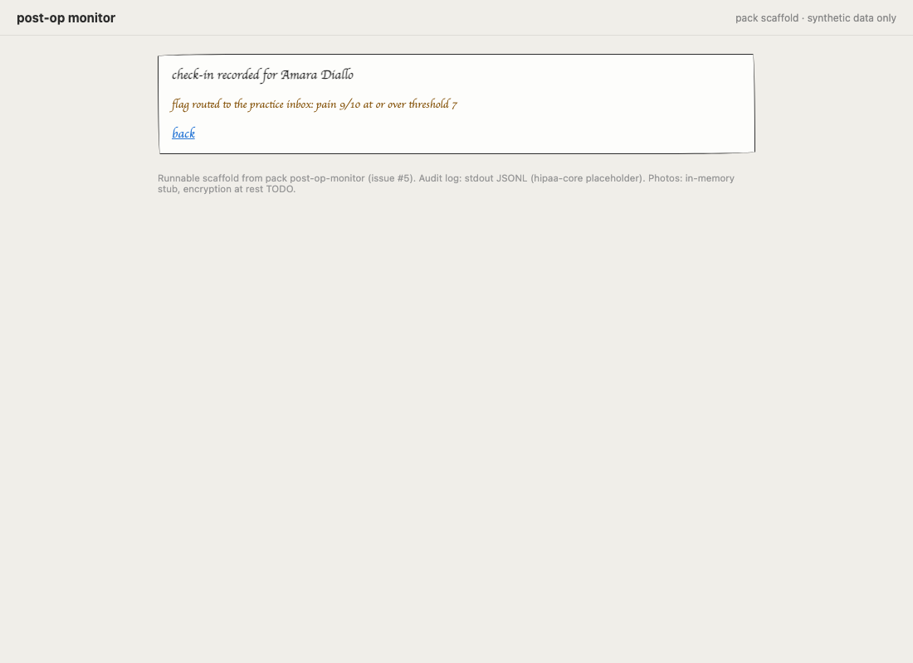

# One journey, profiled — 2026-07-13 at `0bccc87`

One real clinician journey on the flagship pack (post-op-monitor, the
fully-real one), run end to end by `scripts/journey.sh` against a freshly
booted control plane: every step timed, every step cross-referenced to the
audit events it produced, ending with the artifact Dr. Osei owns — ejected,
compiled, booted, and driven. Machine twin: [journey.json](journey.json).

## What Dr. Osei typed

> a post-op recovery tracker for my knee replacement patients

That sentence — authenticated as `dr-osei` (clinician, Meridian Family
Practice) with a dev bearer token from `staging/identities.hcl` — is the
whole spec. Everything below happened to it.

## The stage timeline

| # | stage | wall time | what happened | audit seqs |
|---|---|---|---|---|
| 1 | describe | 18ms | POST /api/apps → app post-op-recovery-tracker in sandbox on synthetic data; 5 scaffold steps; controls pre-wired: [ai-allowlist, audit-log, dependency-scan, phi-encryption, synthetic-only] | 1–4 |
| 2 | ui-sandbox | 213ms | Playwright on the studio: the app open in a synthetic sandbox with conversation and preview → 01-sandbox.png | — |
| 3 | iterate-1 | 12ms | "make pain a 0-10 scale and flag anything over 7 to me" → wired [escalation-path] | 5–7 |
| 4 | iterate-2 | 11ms | "remind patients to log wound photos daily" → wired [nothing — feature only, honest off-vocabulary edit] | 8–10 |
| 5 | gate-failing | 6ms | GET gate → 5/6 satisfied (4 passed + 1 labeled stub), failing: auto-logoff (one-click fixable: true) | — |
| 6 | ui-gate-failing | 184ms | the release gate names the failure and offers its repair → 02-gate-failing.png | — |
| 7 | promote-locked | 5ms | POST real-data promote while failing → 409; named auto-logoff + encryption stub and durably audited the denial | 11 |
| 8 | fix-auto-logoff | 7ms | POST gate/auto-logoff/fix → gate 6/6 satisfied, green (5 passed + 1 labeled stub) | 12–13 |
| 9 | cosign-release | 12ms | POST promote (cosigner "Dr. A. Osei", synthetic_demo=true) → isolated synthetic demo; attestation by dr-osei, digest sha256:161df34d8…; allocation a-d458 (synthetic-demo pool, post-op-recovery-tracker.synthetic-demo.local) | 14–15 |
| 10 | ui-live | 111ms | the live view: synthetic badge, frozen release record, ownership action, and honest runtime status → 03-live.png | — |
| 11 | eject | 7ms | GET export → 30 files, 161028 bytes; README opens with the prompt; README carries the frozen report + digest | 16 |
| 12 | artifact-build | 6744ms | cargo build of the ejected server/ crate — cold, worktree-local target (what a stranger gets) | — |
| 13 | artifact-boot | 319ms | the ejected binary healthy on :39450 against its bundled synthetic seed | — |
| 14 | artifact-drive | 466ms | pain-9 check-in for pt-001 → flag routed to the practice inbox; the app's own audit JSONL recorded 4 events → 04/05/06 screenshots | — |
| | **totals** | | **prompt → isolated synthetic demo: 600ms** (API calls alone: 71ms) · **prompt → ejected app running: 7789ms** (incl. 6744ms compile) | |

Wall times are measured around each HTTP call / build / boot at ms
precision; the ui-* rows are the profiler driving the real doctor UI with
Playwright, so the prompt→live wall clock includes them.

## The sandbox, as the doctor sees it

Scaffolded in 18ms from the pack: *scaffolding from pack…* → *pain + wound check-in form* → *photo upload (encrypted)* → *audit log wired to every route* → *daily reminder schedule*.
Controls pre-wired on day one: `ai-allowlist`, `audit-log`, `dependency-scan`, `phi-encryption`, `synthetic-only`.



Two conversational edits followed:

- "make pain a 0-10 scale and flag anything over 7 to me" — 12ms, wired `escalation-path`
- "remind patients to log wound photos daily" — 11ms, wired nothing (an off-vocabulary edit: the feature lands, no control is claimed)

Agent tier for every operation: **rules** (scaffold:rules×1, iterate:rules×2) — the deterministic rules floor, recorded honestly.

## The gate story

The preflight gate read **5/6 satisfied** (4 passed
+ 1 labeled stub) with one named failure:

- `auto-logoff` — auto-logoff after idle — not wired (one-click fixable: true)



Promotion while failing was refused — HTTP 409, the product's own words, verbatim:

```json
{"error":"deploy locked: principal dr-osei denied promotion of app post-op-recovery-tracker at v3; report 4/6 (1 stubbed) (real-data release requested) digest sha256:c9284d4d2c473bf3104c62c8d71d3c0a853ff81c219ab38cfbf4754d845c9806; blockers: phi-encryption (encryption on all patient fields): STUBBED — PHI fields rest on a labeled encryption stub — plumbing verified, cipher absent (hipaa-core encryptField via Vault transit is the scaffold's labeled TODO): Patient [name, age, procedure, surgery_date, surgeon] (scaffold/src/main.rs); SeedCheckin [pain, wound, note] (scaffold/src/main.rs); Checkin [patient_id, pain, wound, note] (scaffold/src/main.rs); PhotoStub [patient_id, filename] (scaffold/src/main.rs); auto-logoff (auto-logoff after idle): auto-logoff after idle — not wired"}
```

One click fixed `auto-logoff`; the gate went **green at 6/6**
(5 passed + 1 labeled stub — the stub is satisfied-with-a-caveat, never a pass).
Dr. Osei co-signed as **Dr. A. Osei** and the release attestation bound the
authenticated principal `dr-osei` to the frozen gate report:

- gate summary at release: **5/6 (1 stubbed)**
- report digest: `sha256:161df34d8b12055b47316ea0da38d921f385aa8d6833c5125d97ca626c7917c0`
- allocation: `a-d458` (synthetic-demo pool, nyc3, post-op-recovery-tracker.synthetic-demo.local)



## What they own now

One GET later, the whole app left the platform as a 30-file,
157KB bundle — source, docs generated from Dr. Osei's own record, and
deploy manifests for four targets. No hostage code, no hostage docs.

```
     90  .mcp.json
    984  Dockerfile
  15366  README.md
   1849  artifact-quality.json
    420  config/deploy.yml
    943  config/nginx.conf
    452  config/start.sh
   4770  diagrams/service-map.tldr
   3553  diagrams/system-architecture.tldr
   4123  diagrams/workspace-state-machine.tldr
    347  fly.toml
   2747  nomad/job.nomad.hcl
   1430  pack.hcl
    321  render.yaml
   1129  server/Cargo.toml
  19894  server/src/local_media.rs
  40122  server/src/main.rs
   5598  synthetic/post-op-demo.json
  46366  web/package-lock.json
    469  web/package.json
     47  web/src/app.d.ts
    298  web/src/app.html
   2748  web/src/clinician.css
   3464  web/src/lib/LocalMediaInput.svelte
    111  web/src/routes/+layout.svelte
     26  web/src/routes/+layout.ts
   2630  web/src/routes/+page.svelte
    166  web/svelte.config.js
    326  web/tsconfig.json
    239  web/vite.config.ts
 161028  total
```

The README opens with their own sentence:

```markdown
# post-op recovery tracker

Built on the clinician platform and ejected as an owned, self-contained
repository. It started as one sentence:

> a post-op recovery tracker for my knee replacement patients
```

And COMPLIANCE.md carries the release evidence frozen at promotion —
"Gate report (frozen at promotion, app v4)", with its digest line verbatim:

```markdown
- gate report digest: `sha256:161df34d8b12055b47316ea0da38d921f385aa8d6833c5125d97ca626c7917c0` — sha256 over the frozen report's canonical JSON; the co-sign binds exactly this evidence (#10)
```

The profiler then did what a stranger would: unpacked the bundle, ran
`cargo build` (6744ms), booted the binary against its bundled synthetic
seed (319ms), and used it:

| the ejected app, SYNTHETIC banner up | a pain-9 check-in filled | the flag, routed |
|---|---|---|
|  |  |  |

The ejected app kept its own books — its stdout audit JSONL during the
interaction, verbatim:

```json
{"action":"http.request","actor":"anonymous","at":1783920713,"control":"audit-log","method":"GET","note":"hipaa-core placeholder — stdout JSONL until the shared audit library lands","path":"/login","status":200}
{"action":"http.request","actor":"anonymous","at":1783920713,"control":"audit-log","method":"POST","note":"hipaa-core placeholder — stdout JSONL until the shared audit library lands","path":"/login","status":303}
{"action":"http.request","actor":"demo-patient","at":1783920713,"control":"audit-log","method":"GET","note":"hipaa-core placeholder — stdout JSONL until the shared audit library lands","path":"/","status":200}
{"action":"http.request","actor":"demo-patient","at":1783920713,"control":"audit-log","method":"POST","note":"hipaa-core placeholder — stdout JSONL until the shared audit library lands","path":"/checkin","status":200}
```

## The audit spine

Every platform action above, from the append-only stream (offsets from the
moment the prompt was sent; the stream's clock is 1-second granular):

| seq | +ms | actor | action | detail |
|---|---|---|---|---|
| 1 | +0 | dr-osei | `app.created` | described from pack post-op-monitor |
| 2 | +0 | agent | `agent.routed` | per platform default routing (pack post-op-monitor declares none): scaffold→frontier (frontier unconfigured — resolved to rules) |
| 3 | +0 | agent | `agent.attempt` | op op-39d6 scaffold v1 tier=rules verdict=accepted → applied |
| 4 | +0 | agent | `agent.scaffolded` | 4 features from pack post-op-monitor, sandbox pool, synthetic data only |
| 5 | +0 | agent | `agent.routed` | per platform default routing (pack post-op-monitor declares none): iterate→local (local unconfigured — resolved to rules) |
| 6 | +0 | agent | `agent.attempt` | op op-6076 iterate v2 tier=rules verdict=accepted → applied |
| 7 | +0 | dr-osei | `app.iterated` | addendum 2 (landed by agent tier rules, op op-6076) |
| 8 | +0 | agent | `agent.routed` | per platform default routing (pack post-op-monitor declares none): iterate→local (local unconfigured — resolved to rules) |
| 9 | +0 | agent | `agent.attempt` | op op-8718 iterate v3 tier=rules verdict=accepted → applied |
| 10 | +0 | dr-osei | `app.iterated` | addendum 3 (landed by agent tier rules, op op-8718) |
| 11 | +0 | dr-osei | `gate.promotion_denied` | principal dr-osei denied promotion of app post-op-recovery-tracker at v3; report 4/6 (1 stubbed) (real-data release requested) digest sha256:c9284d4d2c473bf3104c62c8d71d3c0a853ff81c219ab38cfbf4754d845c9806; blockers: phi-encryption (encryption on all patient fields): STUBBED — PHI fields rest on a labeled encryption stub — plumbing verified, cipher absent (hipaa-core encryptField via Vault transit is the scaffold's labeled TODO): Patient [name, age, procedure, surgery_date, surgeon] (scaffold/src/main.rs); SeedCheckin [pain, wound, note] (scaffold/src/main.rs); Checkin [patient_id, pain, wound, note] (scaffold/src/main.rs); PhotoStub [patient_id, filename] (scaffold/src/main.rs); auto-logoff (auto-logoff after idle): auto-logoff after idle — not wired |
| 12 | +0 | agent | `agent.attempt` | op op-adb8 fix v4 tier=rules verdict=accepted → applied |
| 13 | +0 | agent | `gate.fixed` | wired control auto-logoff |
| 14 | +0 | gate-engine | `gate.passed` | preflight 5/6 (1 stubbed) green at v4 |
| 15 | +0 | deploy | `app.promoted` | deploy v4 approved (preflight 5/6 (1 stubbed)) — co-signed Dr. A. Osei (dr-osei) binding report digest sha256:161df34d8b12055b47316ea0da38d921f385aa8d6833c5125d97ca626c7917c0 — allocation a-d458 in synthetic-demo pool |
| 16 | +717 | dr-osei | `app.exported` | ejection bundle: 30 files, docs from the record, pack post-op-recovery-tracker-template derived — no hostage code |

## Honesty footnotes

- agent tier: every scaffold/iterate ran on the deterministic rules driver (scaffold:rules×1, iterate:rules×2) — the honest floor; no model endpoint was configured (decision 0002 keeps sandbox/CI model-free).
- allocation a-d458 is simulated in dev mode (in-memory control plane, no Nomad configured) — the same promote renders a real Nomad job in staging (#2/#6).
- the pack's phi-encryption check is a labeled stub — it satisfies the meter as "stubbed", is never drawn as a pass, and the ejected app labels encryption-at-rest as a TODO on its own page.
- the gate meter reads 5/6 before the fix because the labeled stub counts as satisfied-with-a-caveat: 4 passed + 1 stub, auto-logoff failing.
- the locked promote (409) is enforcement without an audit event today — the refusal is captured here verbatim from the HTTP body; only state-changing actions land on the app's stream.
- audit offsets are derived from the stream's 1-second timestamps; stage wall times are measured around each HTTP call/build/boot at ms precision.
