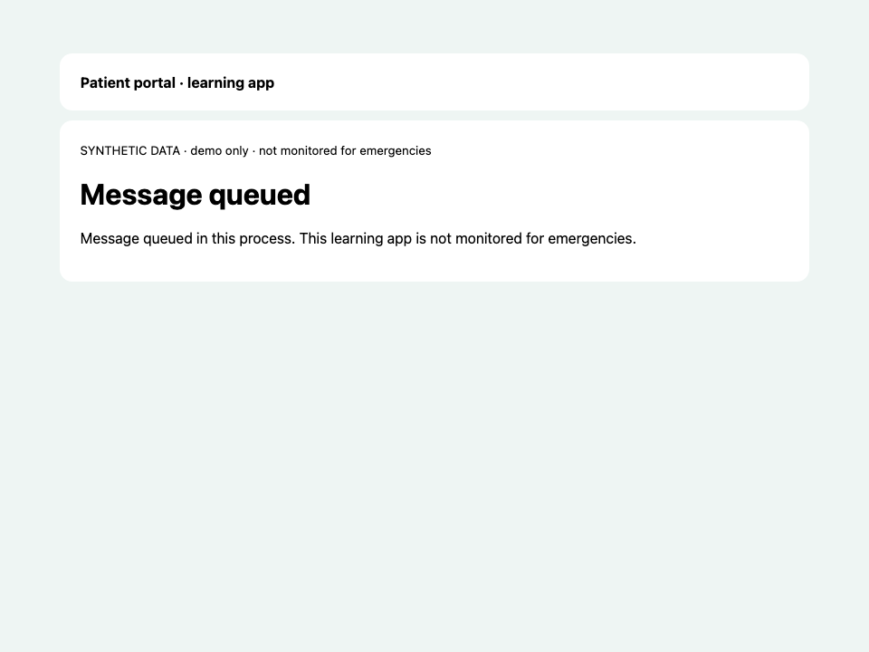
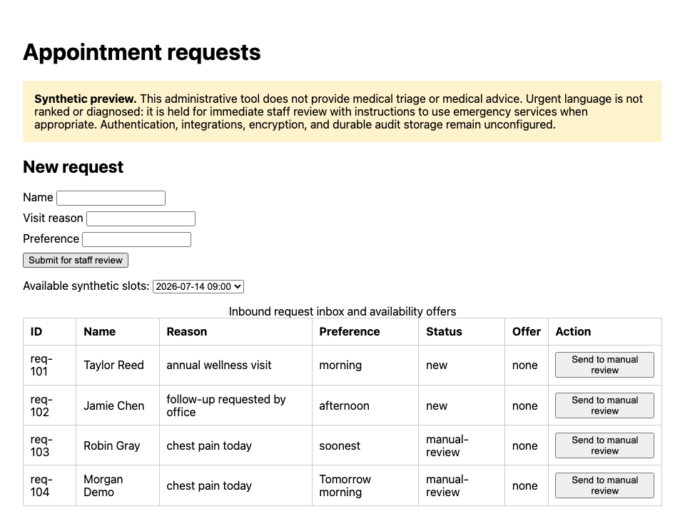
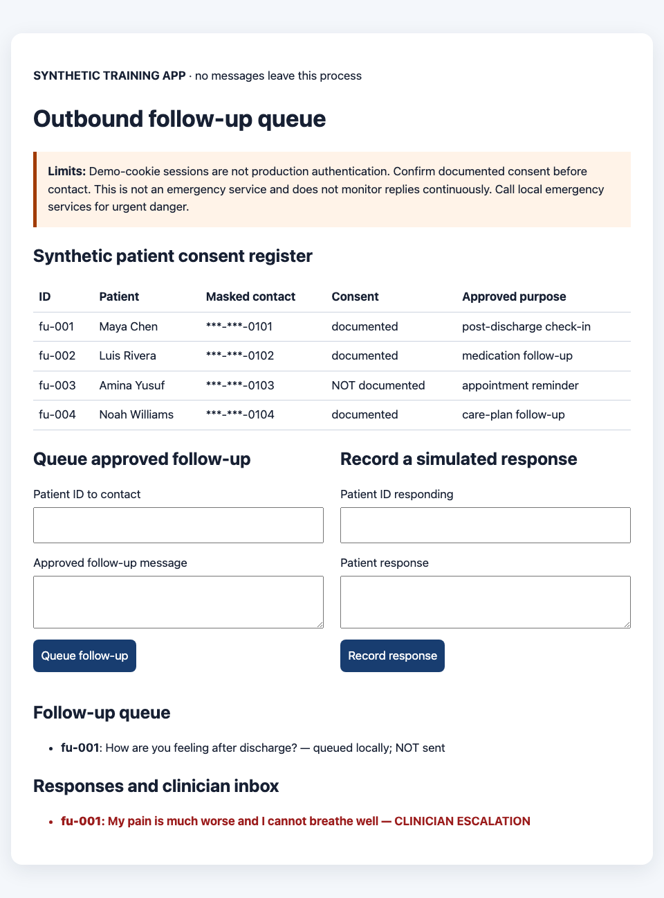
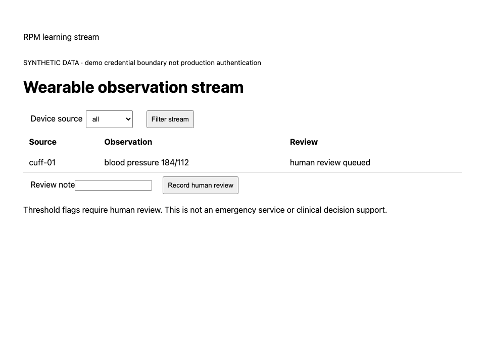
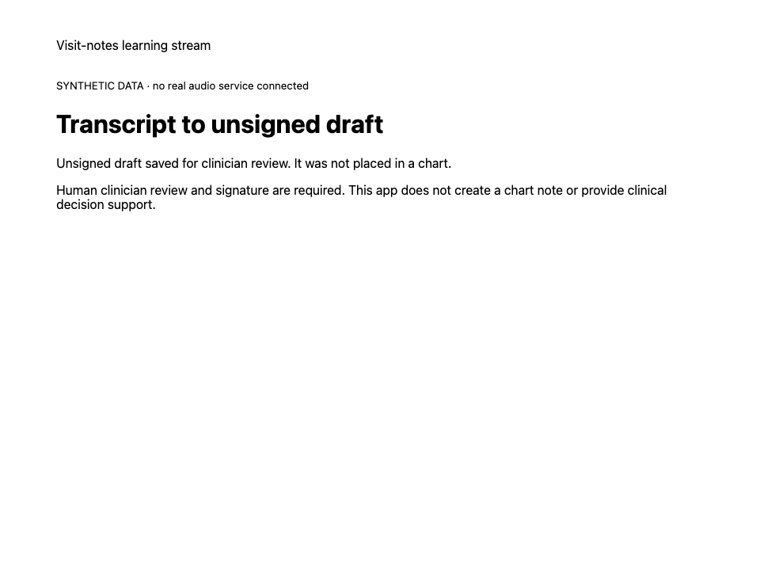
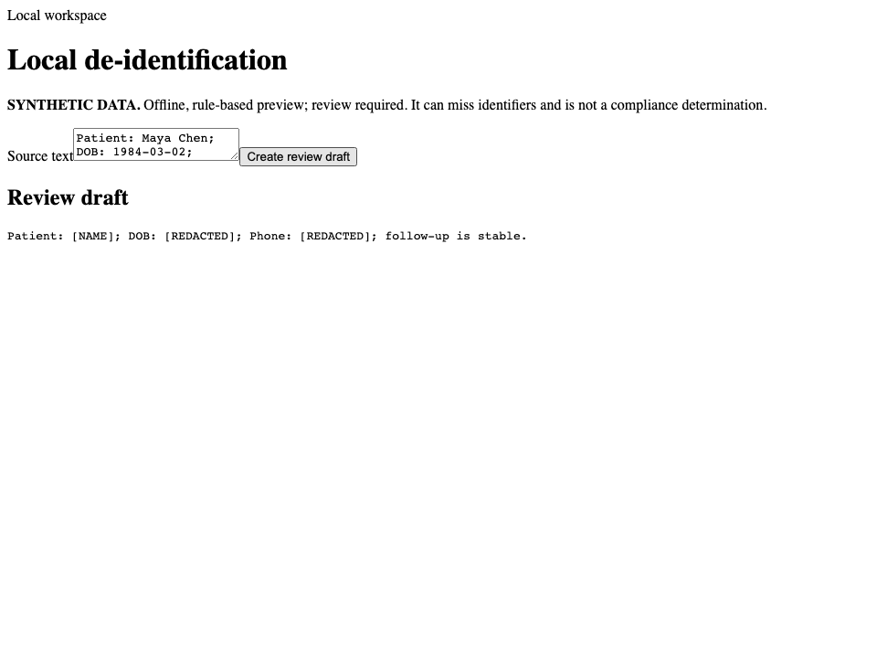
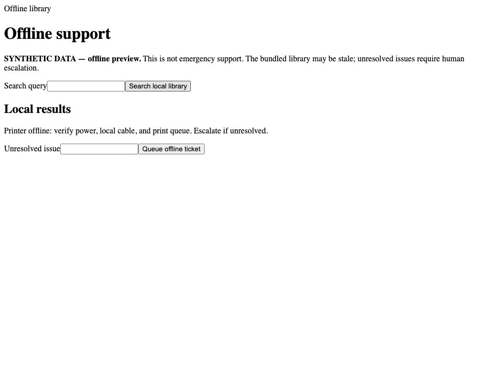
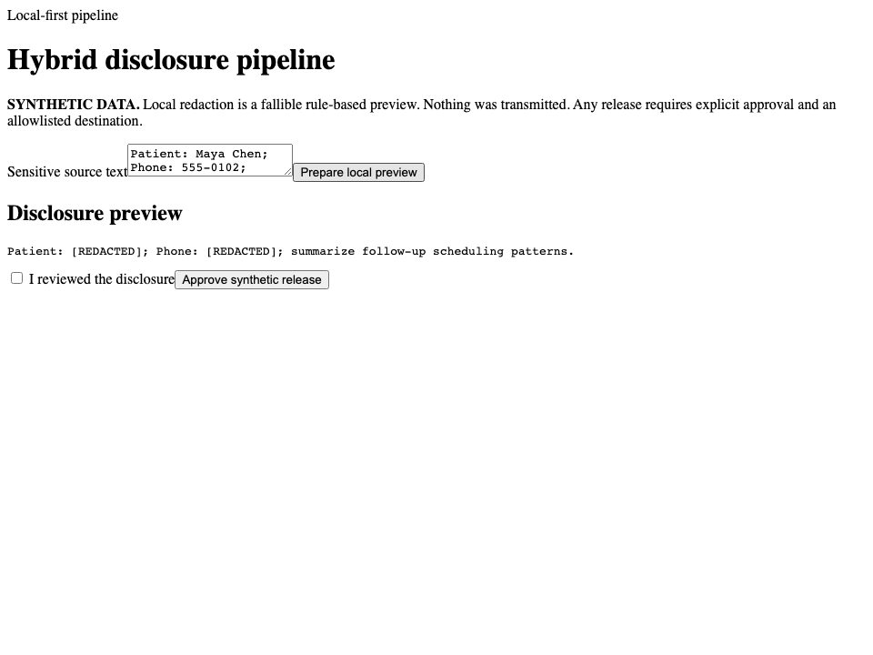

# Sample artifact profiles — 12 owned clinical apps

This review samples 12 of the 17 in-scope artifacts across all three runtime
profiles. It asks three separate questions:

1. **Job:** does the running artifact complete the clinician or staff job in
   its executable browser journey?
2. **Continue:** can a new owner locate the workflow, fixture, safety contract,
   and next safe change without returning to the platform?
3. **Export:** is the repository self-contained, documented, deployable, and
   re-importable as a practice-owned starter?

Scores use a five-point scale. They describe the exported synthetic learning
artifact, not readiness for real patient information.

## Result

All 12 sampled apps built, booted, and completed their browser-driven job. All
exports now include pack-specific `docs/CUSTOMIZE.md` guidance in addition to
source, a synthetic fixture, quality contract, runbook, compliance record,
Dockerfile, Nomad/Render/Fly/Kamal manifests, and a re-importable `pack.hcl`.

| Artifact | Profile | Observed user outcome | Job | Continue | Export | First production customization |
|---|---|---|---:|---:|---:|---|
| post-op monitor | web | Authenticated high-pain check-in creates a practice flag | 5 | 4 | 5 | Durable encrypted photo storage and real identity |
| hypertension tracker | web | Out-of-range reading enters the clinician alert path | 5 | 4 | 5 | Patient identity, persistence, configurable thresholds |
| patient intake | web | Submitted intake becomes a structured chart summary | 5 | 4 | 5 | Durable form schema, staff auth, EHR handoff |
| insurance verification | web | Eligibility result enters a reviewed front-desk queue | 4 | 4 | 5 | Payer connector, durable queue, staff authorization |
| patient portal | web | Patient sees only their record and queues a message | 4 | 4 | 5 | OIDC/session management and durable messaging |
| inbound scheduling | web | Urgent language is held for manual review, not auto-triaged | 4 | 4 | 5 | Calendar connector, staff auth, persistent requests |
| outbound follow-up | web | Consent-aware outreach and concerning response escalation work | 4 | 4 | 5 | Messaging provider, durable consent/STOP ledger |
| RPM wearables | stream | Device-filtered observation appears in a human-review queue | 4 | 4 | 5 | Durable event broker, device identity, policy editor |
| visit notes | stream | Transcript segments produce an unsigned reviewable draft | 4 | 4 | 5 | Consent/audio driver, clinician auth, structured export |
| local de-identification | local | Offline identifier replacement produces a review draft | 4 | 4 | 5 | Evaluated recognizer/model bundle and redaction test corpus |
| air-gapped support | local | Bundled reference search works without a network dependency | 4 | 4 | 5 | Signed content updates and durable ticket export |
| hybrid pipeline | local | Local disclosure preview proves nothing was transmitted | 4 | 4 | 5 | Enforced network boundary and approved non-PHI sidecar |

**Interpretation:** the sample clears the “useful owned starter” bar. It does
not clear the “real-patient production system” bar. Most artifacts are compact
single-file Axum applications with process-local state. That is good for
learning and first customization, but persistence, real identity, integrations,
backups, workload egress, and deployment under an executed BAA remain explicit
production responsibilities.

## Individual profiles

### 1. Post-op monitor

- **Problem solved:** a patient completes a pain/wound check-in and a high pain
  value becomes visible to the practice.
- **Why it leads the sample:** it has the deepest workflow, including demo
  patient/clinician boundaries and a 13-step executable journey.
- **Continue here:** change escalation behavior and routes in
  `app/src/main.rs`, fixtures in `synthetic/post-op-demo.json`, then extend the
  browser journey in `artifact-quality.json`.
- **Caution:** the larger single source file should be split into auth,
  check-in, storage, and presentation modules before substantial extension.

### 2. Hypertension tracker

- **Problem solved:** records a home blood-pressure reading and routes an
  urgent systolic value to the clinician alert view.
- **Best next change:** move threshold values into reviewed practice policy
  configuration rather than adding more hard-coded branches.
- **Production boundary:** process-local readings and no real patient identity.

### 3. Patient intake

- **Problem solved:** turns a patient-facing submission into a structured
  summary instead of another free-text clipboard.
- **Best next change:** make fields a versioned schema and add one exported
  summary format before attempting an EHR integration.
- **Production boundary:** no durable record store or staff authorization.

### 4. Insurance verification

- **Problem solved:** gives front-desk staff a reviewed eligibility queue.
- **Why Job is 4/5:** the queue workflow is real, but the eligibility response
  is synthetic rather than returned by a payer.
- **Best next change:** define a provider trait and add a recorded fake before
  connecting an approved payer endpoint.

### 5. Patient portal

- **Problem solved:** demonstrates patient-scoped visibility and secure-message
  intent without showing another synthetic patient's record.
- **Why Job is 4/5:** the boundary works, but credentials and messages are demo
  state rather than a durable identity/messaging system.
- **Best next change:** replace the demo login behind the same role checks;
  preserve the cross-patient negative journey.

### 6. Inbound scheduling

- **Problem solved:** accepts an appointment request while routing urgent
  language to manual review instead of pretending to perform clinical triage.
- **Best next change:** implement a calendar adapter and keep “manual-review” as
  a non-negotiable state transition.
- **Production boundary:** no staff login, durable inbox, or calendar system.

### 7. Outbound follow-up

- **Problem solved:** checks consent, queues approved outreach, records a reply,
  escalates concerning language, and respects opt-out intent.
- **Best next change:** make consent and STOP events an append-only durable
  ledger before adding an SMS/email provider.
- **Production boundary:** no message is actually sent, which the UI states.

### 8. RPM wearables

- **Problem solved:** filters synthetic wearable observations by device and
  exposes a threshold event for human review.
- **Why Job is 4/5:** the SSE shape is useful, but there is no durable broker,
  device authentication, or drain-survival proof.
- **Best next change:** introduce an event-source trait and replayable fixture
  before choosing a production queue.

### 9. Visit notes

- **Problem solved:** streams speaker-attributed transcript segments into an
  explicitly unsigned draft that a clinician can edit and save for review.
- **Best next change:** add a consent/session record and structured export; do
  not add automatic chart write as a shortcut.
- **Production boundary:** synthetic transcript and no voice vendor driver.

### 10. Local de-identification

- **Problem solved:** creates a reviewable identifier-replacement draft while
  keeping the workflow local.
- **Why Job is 4/5:** it proves the interaction and offline posture, not robust
  clinical de-identification accuracy.
- **Best next change:** add a synthetic adversarial corpus and measured recall
  before replacing the rule preview with an on-device model.

### 11. Air-gapped support

- **Problem solved:** searches a bundled reference library and queues support
  work in a disconnected environment.
- **Best next change:** define a signed, versioned reference bundle and a
  removable-media export format.
- **Production boundary:** content updates and queued work are not durable.

### 12. Hybrid pipeline

- **Problem solved:** prepares a local redacted disclosure preview and clearly
  states that nothing was transmitted.
- **Best next change:** make the local/cloud seam an explicit interface with an
  allowlisted payload contract and approval receipt.
- **Production boundary:** the sidecar is simulated and network isolation is
  not yet an observed runtime control.

## Cross-sample findings

### What is strong

- The browser contract tests the actual user outcome, not just `/health`.
- Every artifact carries its originating prompt, addenda history, gate report,
  audit excerpt, fixture, and source.
- `docs/CUSTOMIZE.md` now makes the next change discoverable and teaches the
  owner to update the fixture and browser contract together.
- Five export targets/forms are present: Docker, Nomad, Render, Fly, and Kamal;
  `pack.hcl` is the re-import/share path.
- Safety boundaries are visible: synthetic-only, unsigned drafts, human review,
  no emergency-service or production-readiness claims.

### What should improve next

1. **Modularize the scaffold shape.** Most apps put routes, state, HTML, and
   tests in one file. Split shared concerns once the second customization lands,
   not pre-emptively before the workflow is understood.
2. **Add a customization regression scenario.** Export, change one requested
   behavior, update its contract, rebuild, and prove re-import. Current evidence
   proves the starting repository, not a stranger's first modification.
3. **Make state adapters explicit.** Process-local storage is the most common
   gap. Add traits plus recorded fakes before database/vendor implementations.
4. **Profile-native proof.** Stream apps need queue/drain survival; local apps
   need networking-disabled execution and local audit import.
5. **Separate demo auth from production identity.** Preserve role/scope tests
   while replacing credentials and sessions underneath them.

## Evidence

- Full baseline: [scorecard.md](scorecard.md) — Layer 1 **458/458**, Layer 2
  **432/432** across 78 scenarios.
- Structured sample data: [sample-artifact-profiles.json](sample-artifact-profiles.json).
- Every sampled export contains 14–15 owned files and all five deploy/export
  forms, plus the re-importable pack manifest.
