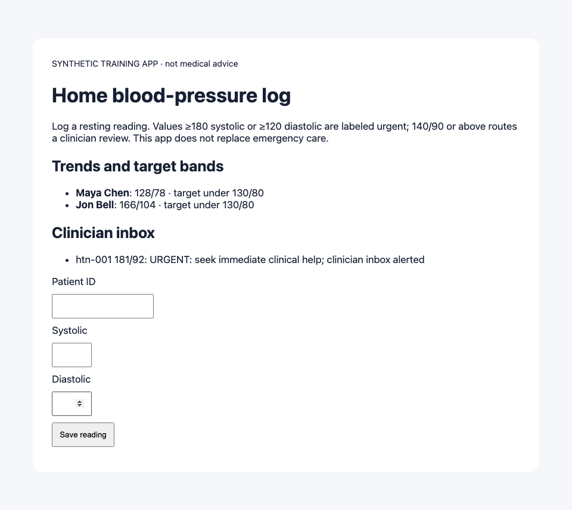
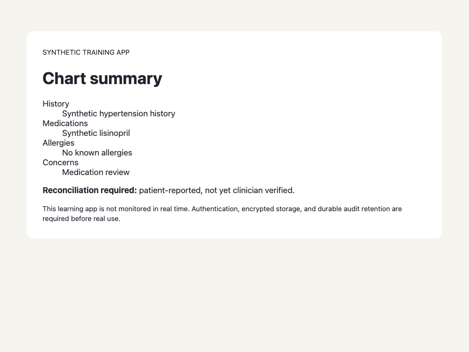
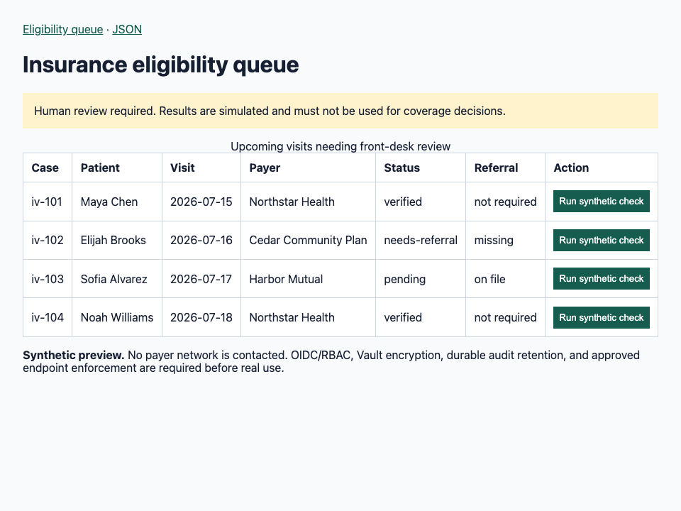
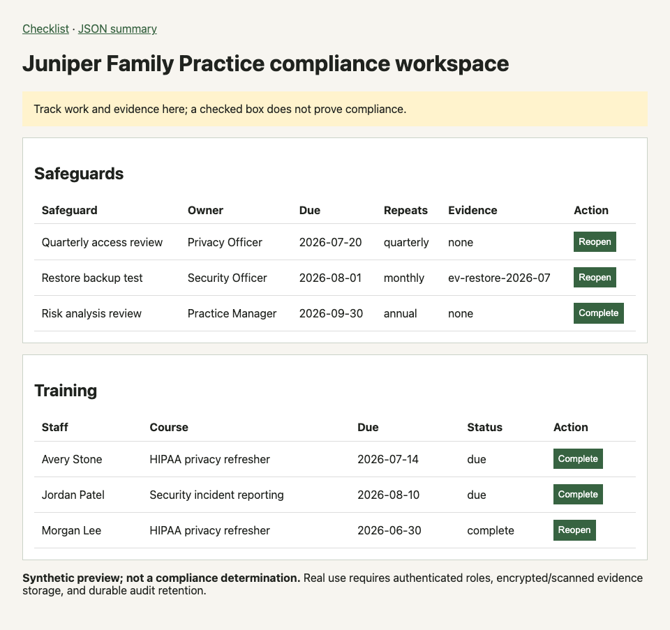
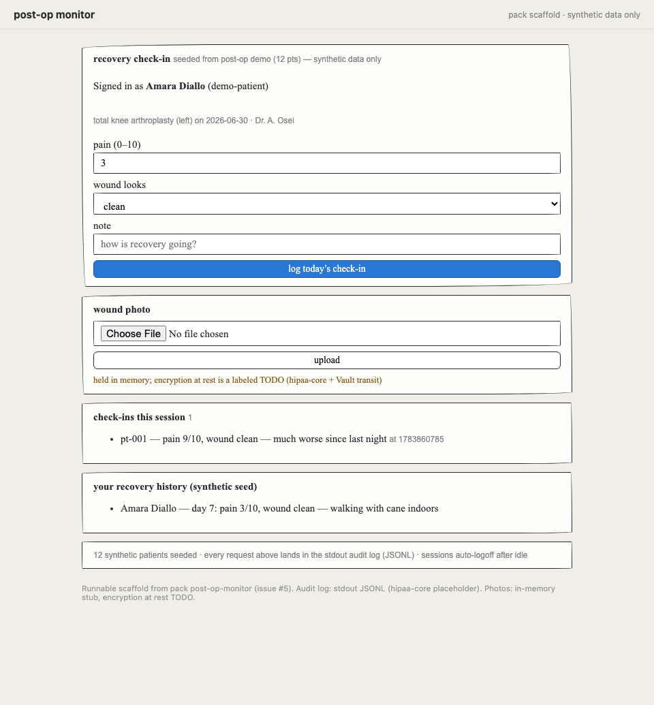

# Platform eval scorecard — the portable baseline

Generated 2026-07-13T00:48:47.386Z at commit `f58d08d` by `scripts/evals.sh` (137s). Machine-readable twin: [scorecard.json](scorecard.json).

## What this measures

Two nested layers over a realistic sampling of how doctors and community
health workers actually phrase things (per pack: precise physician,
colloquial physician, CHP home-visit idiom, terse/typo'd — plus refusal
and edge scenarios):

- **Layer 1 — the job to be done.** Can this persona vibe-code the tool?
  A fresh in-memory control plane per scenario, driven over real HTTP
  through describe → iterate → gate → fix → review → promote → eject,
  scoring the workflow contract (gate shape, false-pass guard,
  attestation, audit reconstructability, bundle completeness).
- **Layer 2 — the artifact.** Is what got produced actually good? The
  ejected bundle is unpacked, **built, and run**, and Playwright drives
  every ejected bundle, builds and boots its Rust app, then interprets
  the pack-owned `artifact-quality.json`. Five hard gates judge whether
  it does its actual clinical/operations job, is fully owned and ejected,
  exposes safety limitations honestly, remains accessible, and carries
  enough documentation for a stranger to run and extend it.

## Summary

| | scenarios | layer 1 checks | layer 2 checks |
|---|---|---|---|
| **all** | 78 | 458/458 passed (100%; 0 expected-fail) | 432/432 passed (100%) |
| airgapped-support | 4 | 24/24 (100%) | 24/24 (100%) |
| identity/tenancy (#10) | 2 | 11/11 (100%) | n/a |
| compliance-checklist | 4 | 24/24 (100%) | 24/24 (100%) |
| clinical-dashboard | 4 | 24/24 (100%) | 24/24 (100%) |
| deid-local | 4 | 24/24 (100%) | 24/24 (100%) |
| patient-intake | 5 | 32/32 (100%) | 30/30 (100%) |
| hypertension-tracker | 5 | 31/31 (100%) | 30/30 (100%) |
| note-extraction-local | 4 | 24/24 (100%) | 24/24 (100%) |
| outbound-followup | 4 | 24/24 (100%) | 24/24 (100%) |
| hybrid-pipeline | 4 | 24/24 (100%) | 24/24 (100%) |
| insurance-verification | 4 | 24/24 (100%) | 24/24 (100%) |
| nemt-logistics | 4 | 24/24 (100%) | 24/24 (100%) |
| patient-portal | 4 | 24/24 (100%) | 24/24 (100%) |
| post-op-monitor | 6 | 36/36 (100%) | 36/36 (100%) |
| refusals (RFC 9/10/15/21) | 4 | 12/12 (100%) | n/a |
| rpm-wearables | 4 | 24/24 (100%) | 24/24 (100%) |
| inbound-scheduling | 4 | 24/24 (100%) | 24/24 (100%) |
| ambient-scribe | 4 | 24/24 (100%) | 24/24 (100%) |
| visit-notes | 4 | 24/24 (100%) | 24/24 (100%) |

## Artifact quality by goal dimension

| pack | actual job | ownership | safety + honesty | accessibility | documentation |
|---|---:|---:|---:|---:|---:|
| airgapped-support | 4/4 | 4/4 | 4/4 | 4/4 | 4/4 |
| compliance-checklist | 4/4 | 4/4 | 4/4 | 4/4 | 4/4 |
| clinical-dashboard | 4/4 | 4/4 | 4/4 | 4/4 | 4/4 |
| deid-local | 4/4 | 4/4 | 4/4 | 4/4 | 4/4 |
| patient-intake | 5/5 | 5/5 | 5/5 | 5/5 | 5/5 |
| hypertension-tracker | 5/5 | 5/5 | 5/5 | 5/5 | 5/5 |
| note-extraction-local | 4/4 | 4/4 | 4/4 | 4/4 | 4/4 |
| outbound-followup | 4/4 | 4/4 | 4/4 | 4/4 | 4/4 |
| hybrid-pipeline | 4/4 | 4/4 | 4/4 | 4/4 | 4/4 |
| insurance-verification | 4/4 | 4/4 | 4/4 | 4/4 | 4/4 |
| nemt-logistics | 4/4 | 4/4 | 4/4 | 4/4 | 4/4 |
| patient-portal | 4/4 | 4/4 | 4/4 | 4/4 | 4/4 |
| post-op-monitor | 6/6 | 6/6 | 6/6 | 6/6 | 6/6 |
| rpm-wearables | 4/4 | 4/4 | 4/4 | 4/4 | 4/4 |
| inbound-scheduling | 4/4 | 4/4 | 4/4 | 4/4 | 4/4 |
| ambient-scribe | 4/4 | 4/4 | 4/4 | 4/4 | 4/4 |
| visit-notes | 4/4 | 4/4 | 4/4 | 4/4 | 4/4 |

## Per-scenario results

| scenario | persona | pack | layer 1 | layer 2 | agent tier |
|---|---|---|---|---|---|
| airgap-01-precise-physician | precise-physician | airgapped-support | 6/6 | 6/6 | rules |
| airgap-02-colloquial-physician | colloquial-physician | airgapped-support | 6/6 | 6/6 | rules |
| airgap-03-clinic-operator | clinic-operator | airgapped-support | 6/6 | 6/6 | rules |
| airgap-04-terse-typo | terse-typo | airgapped-support | 6/6 | 6/6 | rules |
| auth-01-two-tenant | second-practice-clinician | hypertension-tracker | 6/6 | n/a | — |
| auth-02-staff-denial | practice-staff | post-op-monitor | 5/5 | n/a | — |
| checklist-01-precise-physician | precise-physician | compliance-checklist | 6/6 | 6/6 | rules |
| checklist-02-colloquial-physician | colloquial-physician | compliance-checklist | 6/6 | 6/6 | rules |
| checklist-03-chp-clinic | community-health-worker | compliance-checklist | 6/6 | 6/6 | rules |
| checklist-04-terse-typo | terse-typo | compliance-checklist | 6/6 | 6/6 | rules |
| dashboard-01-precise-physician | precise-physician | clinical-dashboard | 6/6 | 6/6 | rules |
| dashboard-02-colloquial-physician | colloquial-physician | clinical-dashboard | 6/6 | 6/6 | rules |
| dashboard-03-clinic-operator | clinic-operator | clinical-dashboard | 6/6 | 6/6 | rules |
| dashboard-04-terse-typo | terse-typo | clinical-dashboard | 6/6 | 6/6 | rules |
| deid-01-precise-physician | precise-physician | deid-local | 6/6 | 6/6 | rules |
| deid-02-colloquial-physician | colloquial-physician | deid-local | 6/6 | 6/6 | rules |
| deid-03-clinic-operator | clinic-operator | deid-local | 6/6 | 6/6 | rules |
| deid-04-terse-typo | terse-typo | deid-local | 6/6 | 6/6 | rules |
| edge-01-duplicate-names | colloquial-physician | patient-intake | 8/8 | 6/6 | rules |
| edge-02-restore-then-promote | precise-physician | hypertension-tracker | 7/7 | 6/6 | rules |
| extract-01-precise-physician | precise-physician | note-extraction-local | 6/6 | 6/6 | rules |
| extract-02-colloquial-physician | colloquial-physician | note-extraction-local | 6/6 | 6/6 | rules |
| extract-03-clinic-operator | clinic-operator | note-extraction-local | 6/6 | 6/6 | rules |
| extract-04-terse-typo | terse-typo | note-extraction-local | 6/6 | 6/6 | rules |
| followup-01-precise-physician | precise-physician | outbound-followup | 6/6 | 6/6 | rules |
| followup-02-colloquial-physician | colloquial-physician | outbound-followup | 6/6 | 6/6 | rules |
| followup-03-nurse-navigator | nurse-navigator | outbound-followup | 6/6 | 6/6 | rules |
| followup-04-terse-typo | terse-typo | outbound-followup | 6/6 | 6/6 | rules |
| htn-01-precise-physician | precise-physician | hypertension-tracker | 6/6 | 6/6 | rules |
| htn-02-colloquial-physician | colloquial-physician | hypertension-tracker | 6/6 | 6/6 | rules |
| htn-03-chp-home-visit | community-health-worker | hypertension-tracker | 6/6 | 6/6 | rules |
| htn-04-terse-typo | terse-typo | hypertension-tracker | 6/6 | 6/6 | rules |
| hybrid-01-precise-physician | precise-physician | hybrid-pipeline | 6/6 | 6/6 | rules |
| hybrid-02-colloquial-physician | colloquial-physician | hybrid-pipeline | 6/6 | 6/6 | rules |
| hybrid-03-clinic-operator | clinic-operator | hybrid-pipeline | 6/6 | 6/6 | rules |
| hybrid-04-terse-typo | terse-typo | hybrid-pipeline | 6/6 | 6/6 | rules |
| insurance-01-precise-physician | precise-physician | insurance-verification | 6/6 | 6/6 | rules |
| insurance-02-colloquial-physician | colloquial-physician | insurance-verification | 6/6 | 6/6 | rules |
| insurance-03-chp-home-visit | community-health-worker | insurance-verification | 6/6 | 6/6 | rules |
| insurance-04-terse-typo | terse-typo | insurance-verification | 6/6 | 6/6 | rules |
| intake-01-precise-physician | precise-physician | patient-intake | 6/6 | 6/6 | rules |
| intake-02-colloquial-physician | colloquial-physician | patient-intake | 6/6 | 6/6 | rules |
| intake-03-chp-home-visit | community-health-worker | patient-intake | 6/6 | 6/6 | rules |
| intake-04-terse-typo | terse-typo | patient-intake | 6/6 | 6/6 | rules |
| nemt-01-precise-physician | precise-physician | nemt-logistics | 6/6 | 6/6 | rules |
| nemt-02-colloquial-physician | colloquial-physician | nemt-logistics | 6/6 | 6/6 | rules |
| nemt-03-care-coordinator | care-coordinator | nemt-logistics | 6/6 | 6/6 | rules |
| nemt-04-terse-typo | terse-typo | nemt-logistics | 6/6 | 6/6 | rules |
| portal-01-precise-physician | precise-physician | patient-portal | 6/6 | 6/6 | rules |
| portal-02-colloquial-physician | colloquial-physician | patient-portal | 6/6 | 6/6 | rules |
| portal-03-chp-home-visit | chp-home-visit | patient-portal | 6/6 | 6/6 | rules |
| portal-04-terse-typo | terse-typo | patient-portal | 6/6 | 6/6 | rules |
| post-op-01-precise-physician | precise-physician | post-op-monitor | 6/6 | 6/6 | rules |
| post-op-02-colloquial-physician | colloquial-physician | post-op-monitor | 6/6 | 6/6 | rules |
| post-op-03-chp-home-visit | community-health-worker | post-op-monitor | 6/6 | 6/6 | rules |
| post-op-04-terse-typo | terse-typo | post-op-monitor | 6/6 | 6/6 | rules |
| post-op-05-nurse-navigator | nurse-navigator | post-op-monitor | 6/6 | 6/6 | rules |
| post-op-06-detailed-protocol | precise-physician | post-op-monitor | 6/6 | 6/6 | rules |
| refusal-01-triage | precise-physician | hypertension-tracker | refused with a written reason ✓ | n/a | — |
| refusal-02-fda-device | precise-physician | post-op-monitor | refused with a written reason ✓ | n/a | — |
| refusal-03-onc-interop | precise-physician | patient-intake | refused with a written reason ✓ | n/a | — |
| refusal-04-enterprise-outcomes | precise-physician | compliance-checklist | refused with a written reason ✓ | n/a | — |
| rpm-01-precise-physician | precise-physician | rpm-wearables | 6/6 | 6/6 | rules |
| rpm-02-colloquial-physician | colloquial-physician | rpm-wearables | 6/6 | 6/6 | rules |
| rpm-03-clinic-operator | clinic-operator | rpm-wearables | 6/6 | 6/6 | rules |
| rpm-04-terse-typo | terse-typo | rpm-wearables | 6/6 | 6/6 | rules |
| scheduling-01-precise-physician | precise-physician | inbound-scheduling | 6/6 | 6/6 | rules |
| scheduling-02-colloquial-physician | colloquial-physician | inbound-scheduling | 6/6 | 6/6 | rules |
| scheduling-03-front-desk | front-desk | inbound-scheduling | 6/6 | 6/6 | rules |
| scheduling-04-terse-typo | terse-typo | inbound-scheduling | 6/6 | 6/6 | rules |
| scribe-01-precise-physician | precise-physician | ambient-scribe | 6/6 | 6/6 | rules |
| scribe-02-colloquial-physician | colloquial-physician | ambient-scribe | 6/6 | 6/6 | rules |
| scribe-03-clinic-operator | clinic-operator | ambient-scribe | 6/6 | 6/6 | rules |
| scribe-04-terse-typo | terse-typo | ambient-scribe | 6/6 | 6/6 | rules |
| visitnotes-01-precise-physician | precise-physician | visit-notes | 6/6 | 6/6 | rules |
| visitnotes-02-colloquial-physician | colloquial-physician | visit-notes | 6/6 | 6/6 | rules |
| visitnotes-03-clinic-operator | clinic-operator | visit-notes | 6/6 | 6/6 | rules |
| visitnotes-04-terse-typo | terse-typo | visit-notes | 6/6 | 6/6 | rules |

## Evidence: the running ejected app

Each image is an **ejected** app, unpacked, compiled, booted, and driven
through the pack-owned job contract by Playwright:

| HTN tracker | Patient intake | Insurance verification | Compliance checklist | Post-op monitor |
|---|---|---|---|---|
|  |  |  |  |  |

## Known gaps (expected failures — this is a regression baseline, not a trophy)

- **Production controls remain incomplete.** The 17 artifacts are synthetic-data learning apps. Authentication, encryption at rest, durable audit retention, runtime egress enforcement, backups, and real infrastructure placement remain production gates; the quality contracts require those limitations to stay visible.
- **Agent tier floor: rules.** No model endpoints were configured, so every scaffold/iterate ran on the deterministic rules driver — this baseline is the honest floor, not a measure of model-tier quality (decision 0002 keeps CI/sandbox model-free by design).
- **The refusal screen is Phase 0 keyword rules (src/refusals.rs).** The four RFC out-of-scope classes are refused with written reasons and every corpus prompt is tuned both ways (unit tests), but a paraphrase outside the rule vocabulary can slip past — a model-based screen slots in behind the same seam (#12).

## Failing checks in full

None.

## Methodology

78 scenarios (70 pack workflows across 17 packs × 4+ personas, 4 refusals from RFC 0001's out-of-scope list, 2 edges: duplicate names, restore-then-promote, 2 identity scenarios: two-tenant isolation, staff role denial), each against a freshly booted in-memory control plane on its own port — no shared state, no mocked HTTP. Every request authenticates with the Phase 0 dev bearer tokens from staging/identities.hcl (#10) — nothing rides the dev fallback. The agent ladder runs at its rules floor (no model endpoints configured), and the scorecard records that tier per operation: this baseline measures what the platform honestly does today, not what a frontier model might add. Layer 2 builds the ejected bundle with a worktree-local shared CARGO_TARGET_DIR (compiles once), boots each ejected app on its own port, and drives it with Playwright/Chromium; external font hosts are blocked so the check is hermetic. Expected-fail checks (refusals) exit zero; any failing check in a must_pass scenario exits nonzero. Add a scenario: drop a JSON file in evals/scenarios/ (schema in evals/README.md) and re-run `scripts/evals.sh`.
