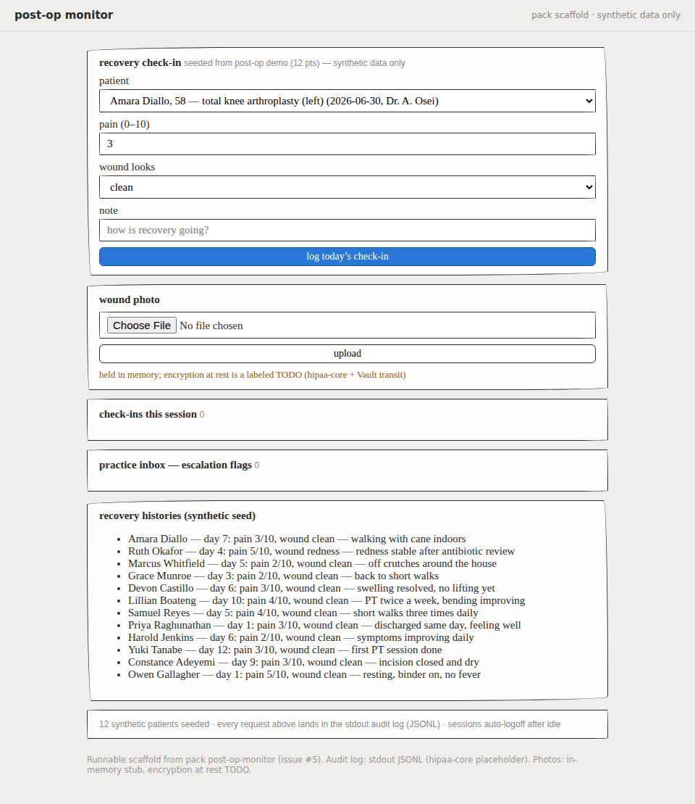
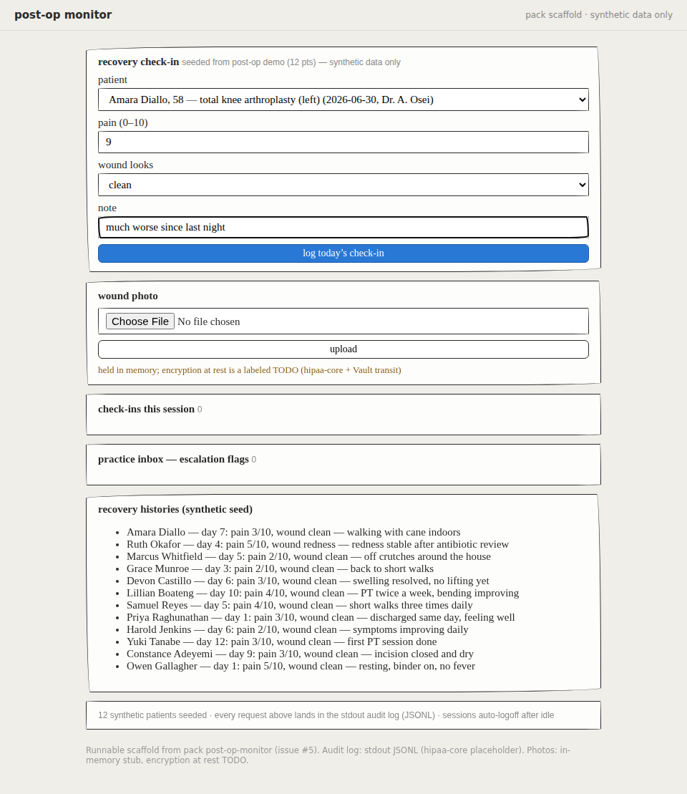
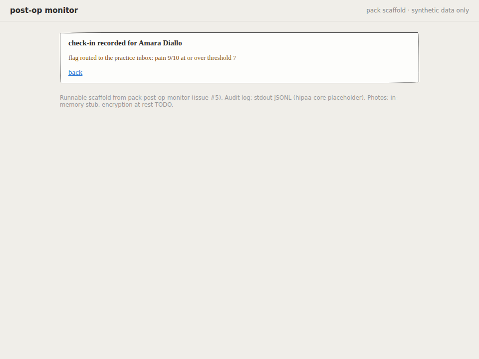

# Platform eval scorecard — the portable baseline

Generated 2026-07-11T21:55:55.314Z at commit `f825298` by `scripts/evals.sh` (10s). Machine-readable twin: [scorecard.json](scorecard.json).

## What this measures

Two nested layers over a realistic sampling of how doctors and community
health workers actually phrase things (per pack: precise physician,
colloquial physician, CHP home-visit idiom, terse/typo'd — plus refusal
and edge scenarios):

- **Layer 1 — the job to be done.** Can this persona vibe-code the tool?
  A fresh in-memory control plane per scenario, driven over real HTTP
  through describe → iterate → gate → fix → review → promote → eject,
  scoring the workflow contract (gate shape, false-pass guard,
  attestation, audit reconstructability, bundle completeness).
- **Layer 2 — the artifact.** Is what got produced actually good? The
  ejected bundle is unpacked, **built, and run**, and Playwright drives
  the running ejected app: it must render the clinical form (with the
  SYNTHETIC banner and the sketchy-kit skin), do the clinical job (a
  pain-9 check-in routes a flag to the practice inbox and the stdout
  audit log; a pain-2 does not), and keep its honesty markers (the
  encryption stub labeled, never claimed). Only post-op-monitor ships a
  runnable scaffold today, so the other four packs score **no-artifact
  (#5 pending)** — visible, never silently skipped.

## Summary

| | scenarios | layer 1 checks | layer 2 checks |
|---|---|---|---|
| **all** | 30 | 170/170 passed (100%; 0 expected-fail) | 18/18 passed (100%) |
| identity/tenancy (#10) | 2 | 11/11 (100%) | n/a |
| compliance-checklist | 4 | 24/24 (100%) | no-artifact (#5 pending) |
| patient-intake | 5 | 32/32 (100%) | no-artifact (#5 pending) |
| hypertension-tracker | 5 | 31/31 (100%) | no-artifact (#5 pending) |
| insurance-verification | 4 | 24/24 (100%) | no-artifact (#5 pending) |
| post-op-monitor | 6 | 36/36 (100%) | 18/18 (100%) |
| refusals (RFC 9/10/15/21) | 4 | 12/12 (100%) | n/a |

## Per-scenario results

| scenario | persona | pack | layer 1 | layer 2 | agent tier |
|---|---|---|---|---|---|
| auth-01-two-tenant | second-practice-clinician | hypertension-tracker | 6/6 | n/a | — |
| auth-02-staff-denial | practice-staff | post-op-monitor | 5/5 | n/a | — |
| checklist-01-precise-physician | precise-physician | compliance-checklist | 6/6 | no-artifact (#5) | rules |
| checklist-02-colloquial-physician | colloquial-physician | compliance-checklist | 6/6 | no-artifact (#5) | rules |
| checklist-03-chp-clinic | community-health-worker | compliance-checklist | 6/6 | no-artifact (#5) | rules |
| checklist-04-terse-typo | terse-typo | compliance-checklist | 6/6 | no-artifact (#5) | rules |
| edge-01-duplicate-names | colloquial-physician | patient-intake | 8/8 | no-artifact (#5) | rules |
| edge-02-restore-then-promote | precise-physician | hypertension-tracker | 7/7 | no-artifact (#5) | rules |
| htn-01-precise-physician | precise-physician | hypertension-tracker | 6/6 | no-artifact (#5) | rules |
| htn-02-colloquial-physician | colloquial-physician | hypertension-tracker | 6/6 | no-artifact (#5) | rules |
| htn-03-chp-home-visit | community-health-worker | hypertension-tracker | 6/6 | no-artifact (#5) | rules |
| htn-04-terse-typo | terse-typo | hypertension-tracker | 6/6 | no-artifact (#5) | rules |
| insurance-01-precise-physician | precise-physician | insurance-verification | 6/6 | no-artifact (#5) | rules |
| insurance-02-colloquial-physician | colloquial-physician | insurance-verification | 6/6 | no-artifact (#5) | rules |
| insurance-03-chp-home-visit | community-health-worker | insurance-verification | 6/6 | no-artifact (#5) | rules |
| insurance-04-terse-typo | terse-typo | insurance-verification | 6/6 | no-artifact (#5) | rules |
| intake-01-precise-physician | precise-physician | patient-intake | 6/6 | no-artifact (#5) | rules |
| intake-02-colloquial-physician | colloquial-physician | patient-intake | 6/6 | no-artifact (#5) | rules |
| intake-03-chp-home-visit | community-health-worker | patient-intake | 6/6 | no-artifact (#5) | rules |
| intake-04-terse-typo | terse-typo | patient-intake | 6/6 | no-artifact (#5) | rules |
| post-op-01-precise-physician | precise-physician | post-op-monitor | 6/6 | 3/3 | rules |
| post-op-02-colloquial-physician | colloquial-physician | post-op-monitor | 6/6 | 3/3 | rules |
| post-op-03-chp-home-visit | community-health-worker | post-op-monitor | 6/6 | 3/3 | rules |
| post-op-04-terse-typo | terse-typo | post-op-monitor | 6/6 | 3/3 | rules |
| post-op-05-nurse-navigator | nurse-navigator | post-op-monitor | 6/6 | 3/3 | rules |
| post-op-06-detailed-protocol | precise-physician | post-op-monitor | 6/6 | 3/3 | rules |
| refusal-01-triage | precise-physician | hypertension-tracker | refused with a written reason ✓ | n/a | — |
| refusal-02-fda-device | precise-physician | post-op-monitor | refused with a written reason ✓ | n/a | — |
| refusal-03-onc-interop | precise-physician | patient-intake | refused with a written reason ✓ | n/a | — |
| refusal-04-enterprise-outcomes | precise-physician | compliance-checklist | refused with a written reason ✓ | n/a | — |

## Evidence: the running ejected app

Screenshots below are of the **ejected** post-op-monitor app — unpacked
from the export bundle, compiled, and driven by the harness (the full
set for every post-op scenario lands in `.evals/screenshots/`, gitignored):

| the form renders | a pain-9 check-in filled | the flag routed |
|---|---|---|
|  |  |  |

## Known gaps (expected failures — this is a regression baseline, not a trophy)

- **Four packs have no runnable scaffold (#5).** hypertension-tracker, patient-intake, compliance-checklist, and insurance-verification eject the honest placeholder runtime, so their artifact layer scores no-artifact — the post-op-monitor pattern needs porting.
- **Agent tier floor: rules.** No model endpoints were configured, so every scaffold/iterate ran on the deterministic rules driver — this baseline is the honest floor, not a measure of model-tier quality (decision 0002 keeps CI/sandbox model-free by design).
- **The refusal screen is Phase 0 keyword rules (src/refusals.rs).** The four RFC out-of-scope classes are refused with written reasons and every corpus prompt is tuned both ways (unit tests), but a paraphrase outside the rule vocabulary can slip past — a model-based screen slots in behind the same seam (#12).

## Failing checks in full

None.

## Methodology

30 scenarios (22 pack workflows across 5 packs × 4+ personas, 4 refusals from RFC 0001's out-of-scope list, 2 edges: duplicate names, restore-then-promote, 2 identity scenarios: two-tenant isolation, staff role denial), each against a freshly booted in-memory control plane on its own port — no shared state, no mocked HTTP. Every request authenticates with the Phase 0 dev bearer tokens from staging/identities.hcl (#10) — nothing rides the dev fallback. The agent ladder runs at its rules floor (no model endpoints configured), and the scorecard records that tier per operation: this baseline measures what the platform honestly does today, not what a frontier model might add. Layer 2 builds the ejected bundle with a worktree-local shared CARGO_TARGET_DIR (compiles once), boots each ejected app on its own port, and drives it with Playwright/Chromium; external font hosts are blocked so the check is hermetic. Expected-fail checks (refusals) exit zero; any failing check in a must_pass scenario exits nonzero. Add a scenario: drop a JSON file in evals/scenarios/ (schema in evals/README.md) and re-run `scripts/evals.sh`.
