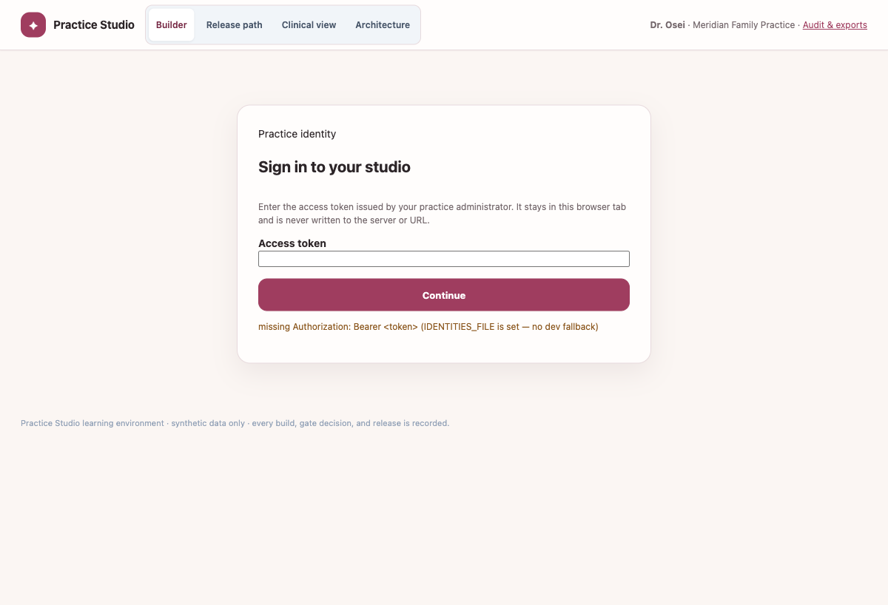
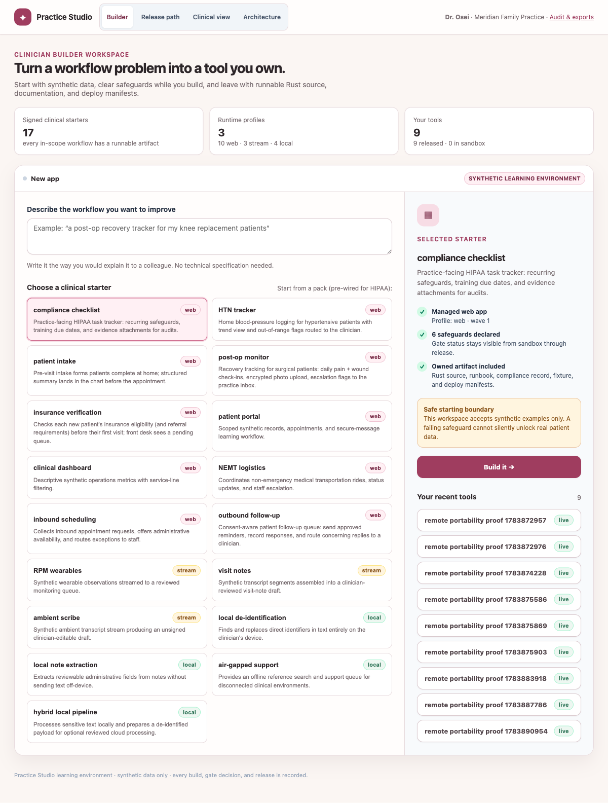
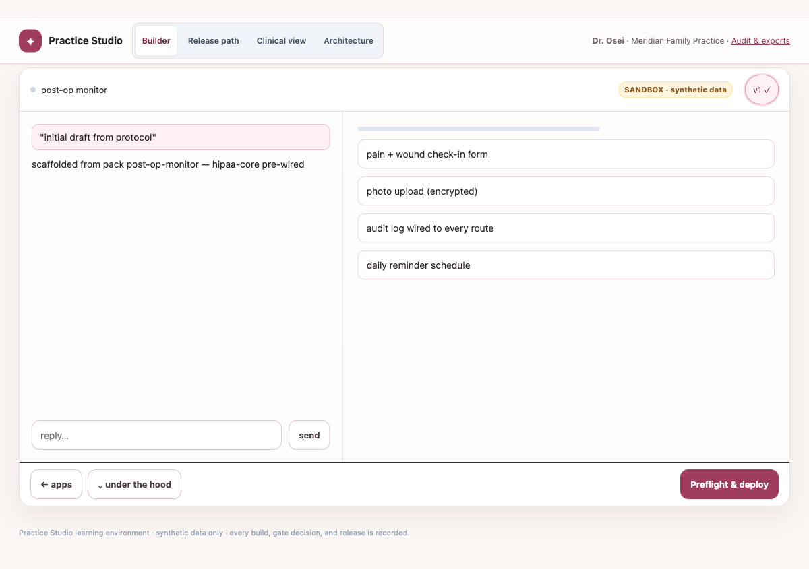
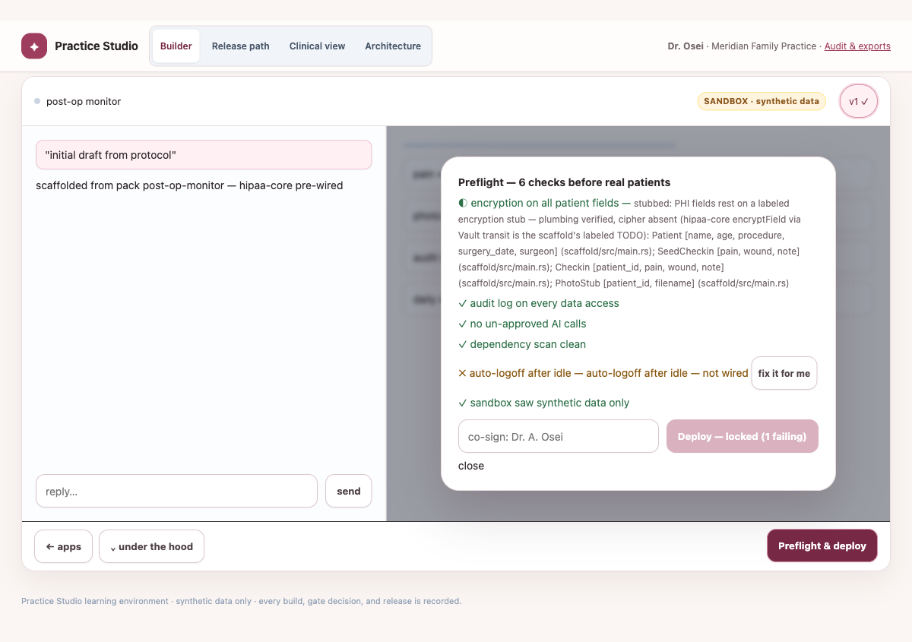
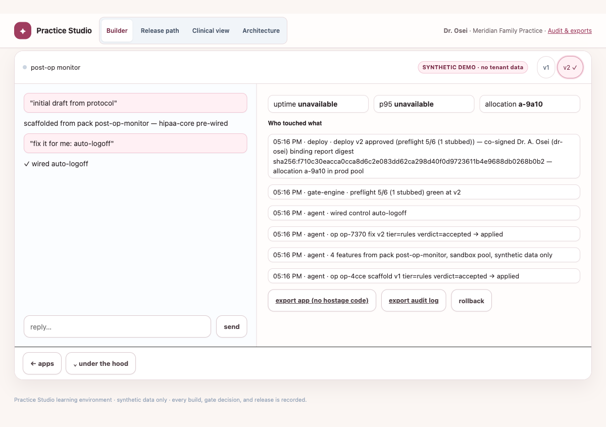
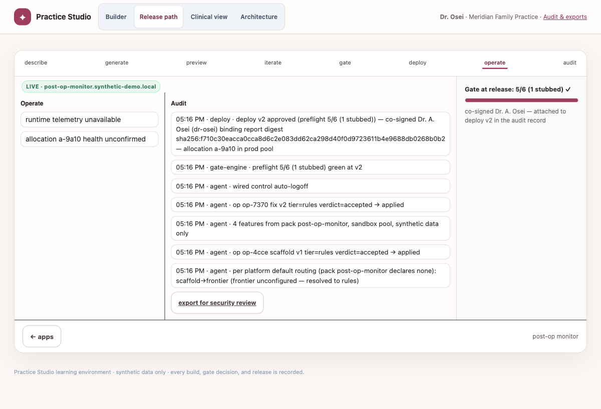

# DigitalOcean staging preview proof

The initial release merged through PR #26 as commit
`862e4f69b4954214a7d48ee0d8b1e874f49ad8cf`. That exact commit was deployed to
the restricted `synthetic-only` DigitalOcean Droplet at
`http://138.197.27.225:3000`.

The provider-neutral remote proof passed after deployment. It created a
synthetic post-op app, repaired the deliberately failing auto-logoff gate,
refused a real-data promotion, published only to the `synthetic-demo` pool,
reported unavailable runtime telemetry honestly, and exported owned Rust
source and deploy manifests.

The browser pass completed the clinician-facing flow: authenticate, choose the
post-op starter, describe the workflow, build, observe the safety block, apply
the suggested fix, co-sign, publish a synthetic demo, and inspect its audit and
release path.

## Screenshots

## Repeatable PR preview

The `staging-preview` workflow accepts a full commit SHA and PR number. The
repository `staging` environment holds `DO_STAGING_HOST`,
`DO_STAGING_SSH_KEY`, and `DO_STAGING_BEARER_TOKEN`. It deploys that exact SHA,
runs the same remote proof, and comments the restricted preview URL on the PR.
Environment protection should require human approval before the shared staging
host changes.

This is POC staging evidence, not a PHI or production authorization. The host
still uses HTTP, repository-known development identities, and one failure
domain.
