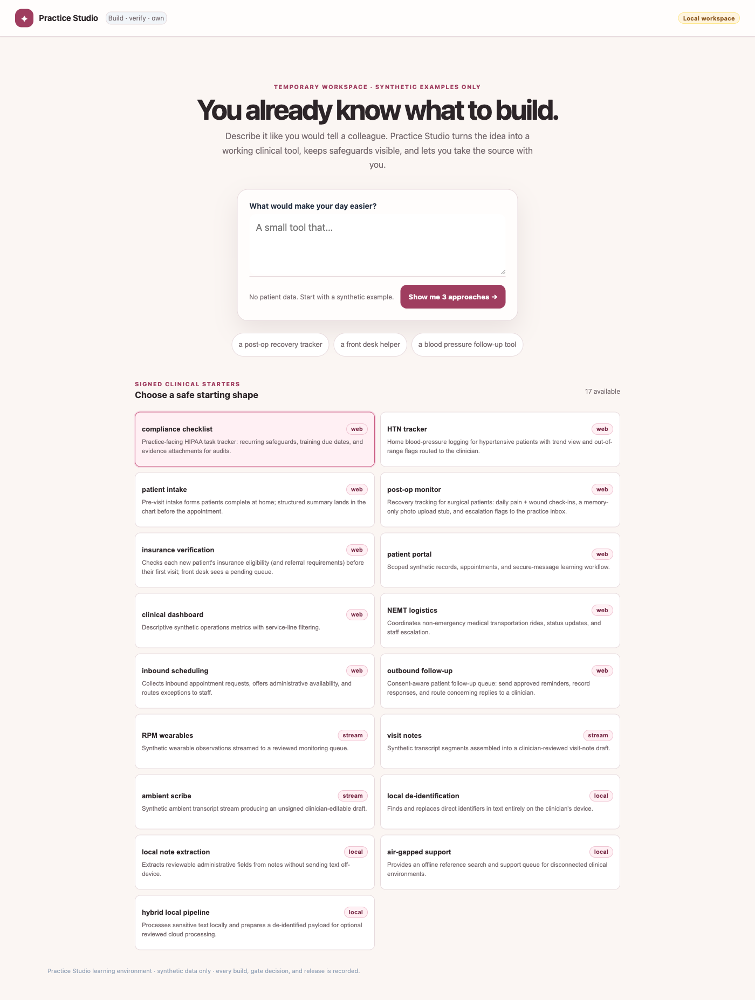
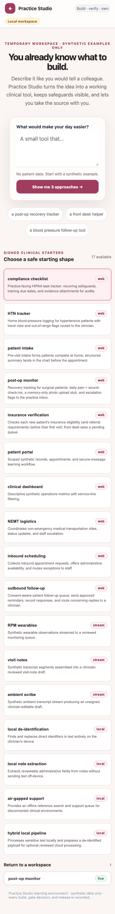
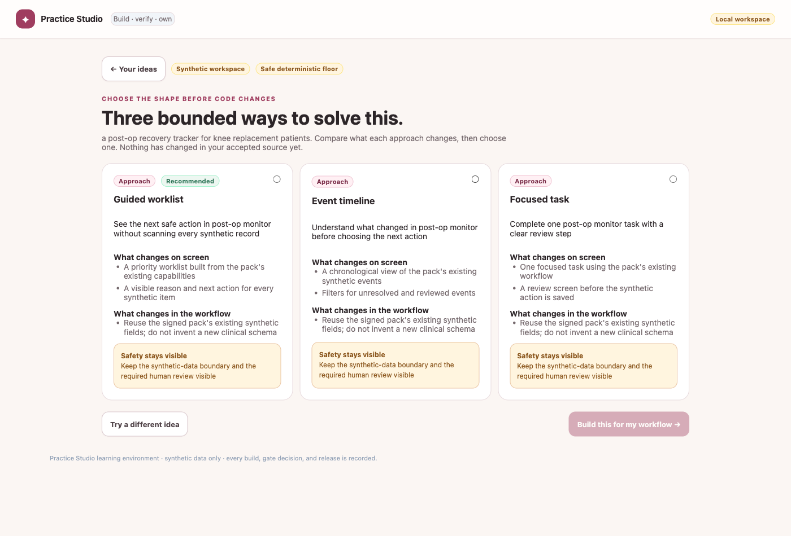
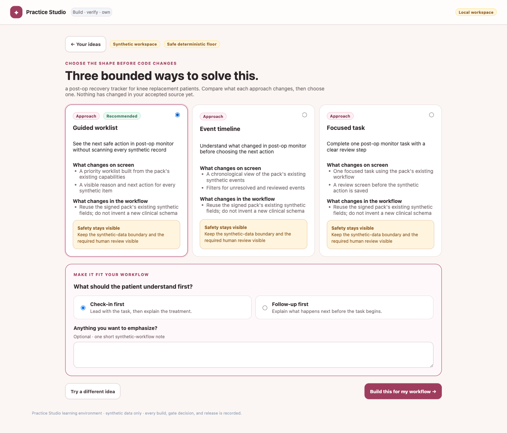
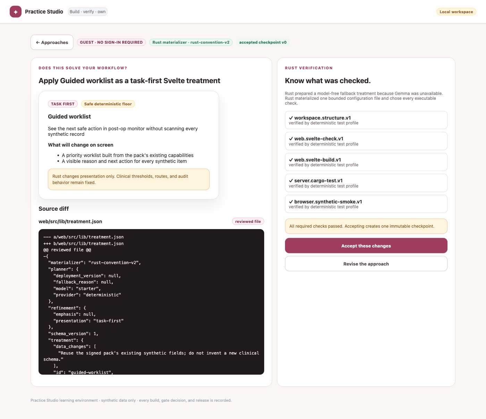
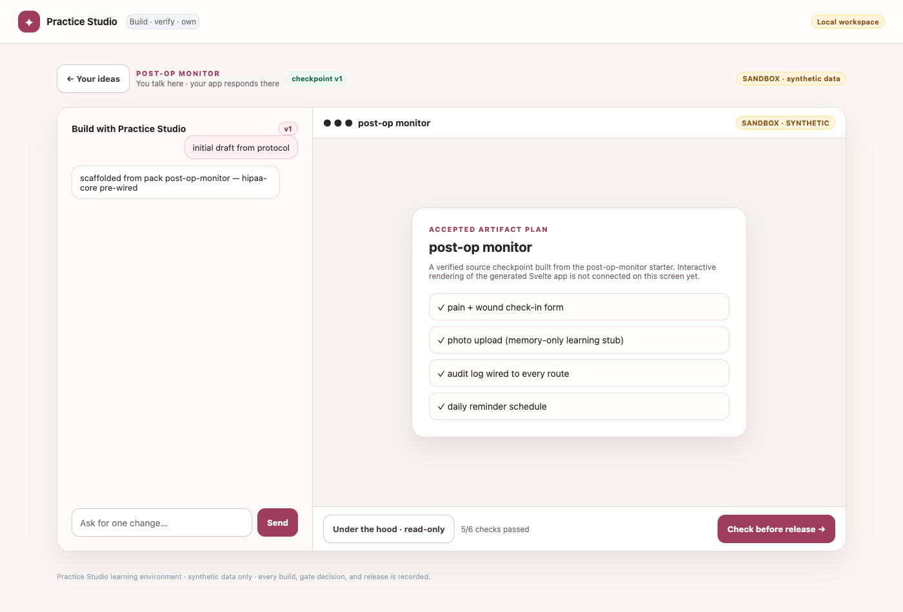
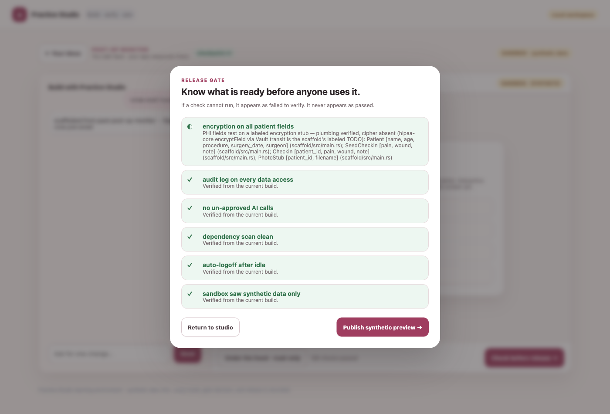
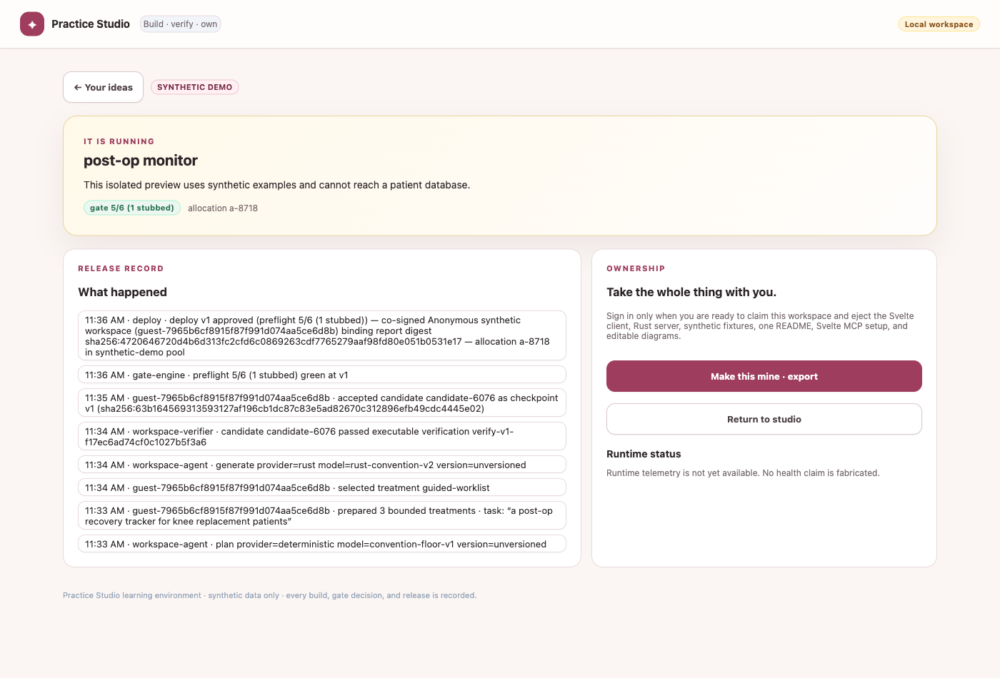
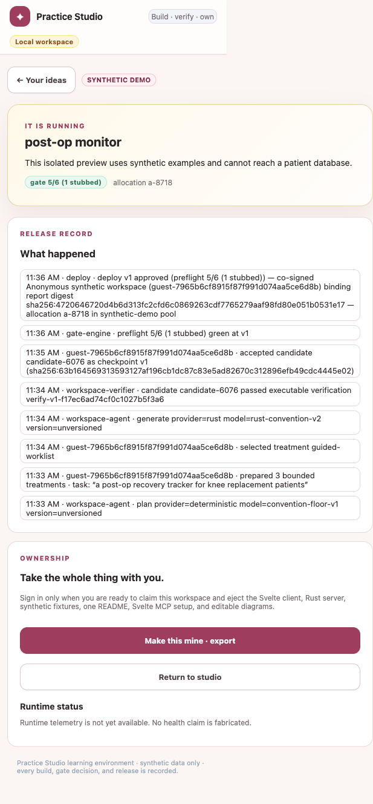

# Doctor UI journey — current main (Practice Studio)

This document captures the doctor-facing "Practice Studio" UI as it actually
runs today, walked end-to-end with real browser automation against a live
`cargo run` instance. It is evidence-based: every claim below is either a
screenshot, an accessibility-tree snapshot, a `curl` response, or a
`browser_evaluate` result captured during this session.

## A note on source-of-truth

The doctor UI is a single file, `web/index.html`, embedded into the Rust
binary at compile time via `include_str!("../web/index.html")`
(`src/api.rs:41`). **The disk copy of `web/index.html` in the main checkout
was being actively edited by another agent while this document was
written** — a `Read` of the file early in this session returned a 714-line
legacy build with no Clerk auth and no "Shakti flow" at all, but a `curl` of
the *running server* moments later returned a 1040-line build with Clerk,
the full Shakti flow, and the legacy skins retired. The disk file changed
under me mid-task.

Rather than chase a moving file, this document is built entirely from the
**served, compiled snapshot** (`GET /` on the running `cargo run` instance,
port 39759), saved locally to
`served-index-snapshot/index.html` in the task scratchpad for citation.
Line numbers below refer to that snapshot, not to whatever the on-disk
`web/index.html` looks like by the time you read this. This is the build a
doctor actually experiences right now.

Server confirmed already running (not started by this task):
`PID 93570`, `target/debug/rust-proof-service`, listening on
`127.0.0.1:39759` (port 3000 was occupied by an unrelated Docker
container). Health check: `curl http://127.0.0.1:39759/health` →
`{"status":"ok","service":"clinician-platform-control-plane"}`.

## State machine overview

One client-side state object, `S` (snapshot lines 185–212), drives
everything. Relevant fields:

- `S.app` / `S.appId` — null until a workspace is built; presence of
  `S.app` plus `live()` (`S.app.stage === "live"`) selects between
  `shaktiDescribe()`, `shaktiStudio()`, and `shaktiLive()` in `render()`
  (line 1024).
- `S.stage` — `"treatments"`, `"generating"`, `"candidate"`, or default
  (studio/conversation view) — dispatched inside `shaktiStudio()`
  (line 940).
- `S.sourceWorkspace` — holds `.treatment_plan`, `.candidate`,
  `.accepted`, `.selected_treatment`, `.plan_agent`,
  `.generation_agent` — the Shakti-specific workspace object, populated by
  `POST /api/apps/:id/workspace/treatments`, `/workspace/select`,
  `/workspace/generate`, `/workspace/candidate/accept|reject`.
- `S.selectedTreatmentId`, `S.treatmentRefinement` — local UI state for the
  3-recipe comparison and its refinement panel.
- `S.authMode` — `"static"` or `"clerk"`, fetched from `GET /auth/config`.
  In this environment: **`{"mode":"static","publishable_key":null}`** —
  Clerk is not configured here (confirmed by direct `curl`).
- `S.owned` — whether the guest workspace has been claimed by a signed-in
  owner. Only meaningful when `S.authMode === "clerk"`.
- `S.gate` / `S.modal` — release-gate report and modal visibility
  (`"preflight"` reuses the field name from the legacy skins, but only
  `shaktiGate()` reads it now).

The header nav (`#skins`) no longer renders a skin switcher. `render()`
(line 1025) unconditionally sets it to a static `<span class="muted">Build
· verify · own</span>`. The `SKINS` map and the four legacy view functions
(`viewBuilder`, `viewPipeline`, `viewChart`, `viewArch`, lines 642–908)
are still present in the file but **dead code** — confirmed by
`browser_evaluate`:

```js
S.skin = 'b'; render();
// → hasSkinButtons: 0
// → skinsHtml: '<span class="muted">Build · verify · own</span>'
// → mainSnippet still the live-dashboard markup, unchanged
```

`render()` never branches on `S.skin` — only on `S.app` / `live()` — so
there is no way to reach the legacy skins from the UI, the URL, or even by
poking `S.skin` from the devtools console. They are not reachable by any
route. Builder/Release-path/Clinical-view/Architecture screenshots were
**not captured** because there is nothing left to screenshot; the four
functions are orphaned code paths.

## Screens walked

### 1. Describe (guest/anonymous entry)



- **Trigger:** `GET /` with no prior session. `initAuth()` (line 302) sees
  `config.mode !== "clerk"`, calls `startWorkspace()` (`POST
  /api/public/session` — issues an anonymous `guest-<id>` tenant) and
  `loadHome()`.
- **State:** `S.app === null` → `render()` shows `shaktiDescribe()`
  (line 913).
- Headline: "You already know what to build." Free-text prompt, 3 quick
  prompt chips, and a catalogue of **17 signed clinical starters** (packs)
  fetched from `GET /api/packs` — far more than the "3 signed treatment
  recipes" language in the task brief suggested; that count applies to
  *treatments per pack*, not to the pack catalogue itself.
- No patient data, no auth required. Copy repeatedly reinforces "synthetic
  examples only."
- **Narrow viewport (375px):** 
  — reflows cleanly to a single column; no overflow observed here (unlike
  the live dashboard, see below).

### 2. Treatment comparison (`shaktiTreatments`)



- **Trigger:** typing a prompt, selecting a pack (`post-op monitor`
  selected here), and clicking "Show me 3 approaches →" → `buildApp()`
  (line 396), which calls `POST /api/apps` then `POST
  /api/apps/:id/workspace/treatments`.
- **State transition:** `S.stage = "treatments"`,
  `S.sourceWorkspace.treatment_plan` populated with exactly 3 treatments
  (`guided-worklist`, `event-timeline`, `focused-task` for this pack).
- Each card shows "what changes on screen," "what changes in the
  workflow," and a safety callout. One card is tagged **Recommended**.
- A provenance tag reading **"Safe deterministic floor"** appears next to
  the recommended-treatment badge (`agentBadge()`, line 958) — this is the
  fallback label shown when the DigitalOcean/Gemma planning agent is
  unavailable; in this environment it fired every time, i.e. treatment
  planning never actually reached a live model during this walkthrough.
- Selecting a card (radio input) reveals a refinement panel
  ("Make it fit your workflow" — task-first vs. context-first framing,
  plus an optional free-text emphasis field) and enables "Build this for
  my workflow →" (disabled until a treatment is chosen):
  

### 3. Candidate generation + review (`shaktiGenerating` / `shaktiCandidateReview`)



- **Trigger:** "Build this for my workflow →" → `buildTreatment()`
  (line 425): sets `S.stage = "generating"` (renders `shaktiGenerating()`,
  a 4-step checklist with only the first step marked active), then awaits
  `POST /api/apps/:id/workspace/select` and
  `POST /api/apps/:id/workspace/generate`.
- **Observed rough edge:** the "generating" transitional screen was not
  independently capturable — in this environment the deterministic
  fallback materializer (`rust-convention-v2`, not a live model) completes
  before a screenshot round-trip can land, so every attempt to catch
  `shaktiGenerating()` mid-flight instead caught the already-resolved
  `shaktiCandidateReview()`. The generation step is effectively
  instantaneous when the model provider is unavailable, which may not be
  representative of latency against a live DigitalOcean/Gemma backend.
- **State:** `S.stage = "candidate"`, `S.sourceWorkspace.candidate`
  populated. Screen shows: the accepted treatment's presentation
  ("task-first"), a unified source diff for exactly one file
  (`web/src/lib/treatment.json`), and 5 Rust-run verification checks (all
  passed: `workspace.structure.v1`, `web.svelte-check.v1`,
  `web.svelte-build.v1`, `server.cargo-test.v1`,
  `browser.synthetic-smoke.v1`).
- Copy is explicit about scope: "Rust changes presentation only. Clinical
  thresholds, routes, and audit behavior remain fixed" — a real, useful
  safety boundary statement, not just marketing copy, since the diff shown
  is indeed a single JSON config file, not app logic.
- Two actions: "Accept these changes" (disabled if verification failed)
  and "Revise the approach" (→ `rejectCandidate()`, returns to the
  treatment-comparison screen with a fresh `S.stage = "treatments"`).

### 4. Studio / accepted-checkpoint workspace (`shaktiStudio` default branch)



- **Trigger:** "Accept these changes" → `acceptCandidate()` (line 437) →
  `POST /api/apps/:id/workspace/candidate/accept`, then
  `S.stage` returns to its default (neither `"treatments"`,
  `"generating"`, nor `"candidate"`), so `shaktiStudio()` falls through to
  its main branch (line 944).
- Two-pane layout: a chat-style conversation log on the left ("Build with
  Practice Studio," seeded with the original build addendum) and a
  read-only preview pane on the right showing the "Accepted artifact
  plan" — pack features as a checklist (`pain + wound check-in form`,
  `photo upload (memory-only learning stub)`, `audit log wired to every
  route`, `daily reminder schedule`).
- Explicitly states: "Interactive rendering of the generated Svelte app is
  not connected on this screen yet" — an honest, self-disclosed gap rather
  than a simulated live preview.
- Footer shows "5/6 checks passed" and a "Check before release →" button
  that opens the gate modal (`S.modal = 'preflight'`).
- A "checkpoint v1" badge and a `SANDBOX · synthetic data` tag are always
  visible in this view.

### 5. Release gate modal (`shaktiGate`)



- **Trigger:** "Check before release →" button, `S.modal === "preflight"`.
- Modal lists all 6 compliance checks from `GET /api/apps/:id/gate`. In
  this walkthrough, 5 passed outright and **1 was "stubbed"**
  (encryption-on-all-patient-fields), rendered with a half-filled `◐`
  marker and a long, specific reason: *"PHI fields rest on a labeled
  encryption stub — plumbing verified, cipher absent (hipaa-core
  encryptField via Vault transit is the scaffold's labeled TODO):
  Patient [...], SeedCheckin [...], Checkin [...], PhotoStub [...]"*
  — this is a genuinely useful, non-hand-wavy disclosure of exactly which
  fields are unencrypted-by-design in the sandbox scaffold, file-anchored
  (`scaffold/src/main.rs`).
- Because this is an anonymous (`guest-*`) tenant, no co-signer input
  field is shown (only rendered `if (!anonymous)`, snapshot line 1016),
  and the release button reads "Publish synthetic preview" rather than
  "Co-sign and release."
- **Accessibility gap (concrete, code-verified):** the modal
  (`.gate-backdrop` / `.gate-card`, snapshot lines 162 and 1016) has no
  `role="dialog"`, no `aria-modal="true"`, no focus movement into the
  modal on open, and no `Escape`-to-close handler anywhere in the file
  (`grep -n "Escape"` over the served snapshot returns zero matches). The
  only affordance to leave is clicking "Return to studio." By contrast,
  the (unreachable, see below) Clerk ownership-gate screen *does* use
  `aria-labelledby` on its `<section>` — so semantic-labelling effort was
  applied inconsistently across the two modal-like screens in this build.

### 6. Live / post-op-monitor dashboard (`shaktiLive`)



- **Trigger:** "Publish synthetic preview →" (anonymous path always sets
  `synthetic_demo = true` in `promote()`, line 456) →
  `POST /api/apps/:id/promote`.
- **State:** `S.app.stage === "live"` → `render()` selects `shaktiLive()`
  directly, bypassing `shaktiStudio()` entirely.
- Shows: a "SYNTHETIC DEMO" badge, "gate 5/6 (1 stubbed)" summary,
  allocation id, a full append-only audit/release record (8 real events
  with SHA-256 digests for each build/gate/promote step — every event we
  triggered from prompt to promote is present, in order, with real
  timestamps), and an ownership panel offering "Make this mine · export."
- Runtime status is honest about its own limits: *"Runtime telemetry is
  not yet available. No health claim is fabricated."*
- **Narrow viewport (375px) — real layout bug:**
  
  The page overflows horizontally to roughly 617px even though the
  viewport is 375px — visible as a hard vertical seam where the header's
  white background stops short of the page edge. Root cause (verified by
  reading the snapshot): the audit-record rows render raw, unbroken
  64-character SHA-256 digests as plain text inside `.sk`-styled `<div>`s
  with no `word-break`/`overflow-wrap` CSS anywhere in the stylesheet.
  A single long hash forces its container — and the whole page — wider
  than the viewport. This is a genuine mobile-usability defect, not a
  cosmetic nit: on a phone, the doctor cannot read the audit log without
  horizontal scrolling, and the header background doesn't even extend to
  cover the overflowed region.

### 7. Clerk ownership gate — **not reachable in this environment**

The task brief describes an ownership gate that appears when a
guest/anonymous user tries to export or claim a workspace, backed by
`@clerk/ui` + `@clerk/clerk-js` (`authView()`, snapshot lines 261–287;
`initAuth()`, lines 302–340). The code path exists and is fully wired:
`requireOwnership()` (line 477) sets `S.authRequired = true` and renders
`authView()` whenever `S.authMode === "clerk"` and the user isn't signed
in.

This was **not reachable** in this session because the running server's
`/auth/config` endpoint returns:

```json
{"mode":"static","publishable_key":null}
```

With no Clerk publishable key configured, `initAuth()` never sets
`S.authMode = "clerk"` — it stays `"static"` — so `requireOwnership()`
(line 478: `if (S.authMode !== "clerk") return true;`) short-circuits to
`true` unconditionally. Verified directly: clicking "Make this mine ·
export" on the live dashboard triggered an immediate download with no
gate, and `browser_evaluate` confirmed `S.authMode === "static"` and
`S.owned === false` throughout. Reaching the real Clerk sign-in screen
would require a deployment with `CLERK_PUBLISHABLE_KEY` (or equivalent)
set, which this environment does not have. No screenshot was fabricated
for this screen.

### 8. Legacy skins (Builder / Release path / Clinical view / Architecture) — **retired, not reachable**

As established above, `viewBuilder`, `viewPipeline`, `viewChart`, and
`viewArch` are present in the file (lines 642, 719, 799, 867 in the
snapshot) but `render()` never calls them and the header no longer offers
a switcher. This was verified two ways: visually (the nav renders as
static muted text, not buttons, in every screenshot above) and
programmatically (`S.skin = 'b'; render()` produces no change — see the
State machine section). No screenshots were taken of these four screens;
there is no way to reach them without editing the JavaScript itself.

## Summary of rough edges actually observed

1. **Header background doesn't cover horizontal overflow at narrow
   widths** on the live dashboard, caused by un-wrapped SHA-256 strings in
   the audit log (`live-narrow.png`). Describe screen at the same width
   (375px) has no such issue.
2. **Gate modal has no dialog semantics** — no `role="dialog"`, no
   `aria-modal`, no focus trap, no `Escape` handling. The only exit is a
   mouse/tap click on "Return to studio."
3. **Inconsistent semantic effort across similar screens** — the (code-
   present but unreachable-here) Clerk auth screen has `aria-labelledby`;
   the gate modal, which is actually reachable, does not.
4. **The "generating" step is not really observable** in this environment
   because the model-planning/materializing agent falls back to a
   deterministic Rust path (no DigitalOcean/Gemma credentials configured
   here) fast enough that no screenshot ever lands on it — every attempt
   landed on the resolved candidate-review screen instead.
5. **Dead code left in the shipped bundle**: four full view functions
   (~270 lines) for the retired skins ship to every browser even though
   they are permanently unreachable.
6. **Honest self-disclosure is a recurring strength, not a rough edge** —
   worth noting because it's atypical: the stubbed-encryption reason on
   the gate, the "no health claim is fabricated" runtime-status copy, and
   the "interactive rendering... is not connected on this screen yet"
   preview caveat are all specific, technically accurate admissions of
   current limitations rather than glossed-over gaps.

## Screenshot index

| File | Screen |
|---|---|
| `describe.png` | Guest describe screen, prompt filled, pack selected |
| `describe-narrow.png` | Describe screen at 375px width |
| `treatments.png` | 3-treatment comparison, none selected |
| `treatments-refinement.png` | Treatment selected, refinement panel open |
| `candidate-review.png` | Source diff + Rust verification checks |
| `studio.png` | Accepted-checkpoint conversation + preview pane |
| `gate.png` | Release gate modal, 5/6 checks (1 stubbed) |
| `live.png` | Post-op-monitor live/synthetic-demo dashboard |
| `live-narrow.png` | Live dashboard at 375px width, showing the overflow bug |

No screenshots exist for the Clerk ownership gate or the four legacy
skins — both are genuinely unreachable in this environment, as documented
in sections 7 and 8 above.
